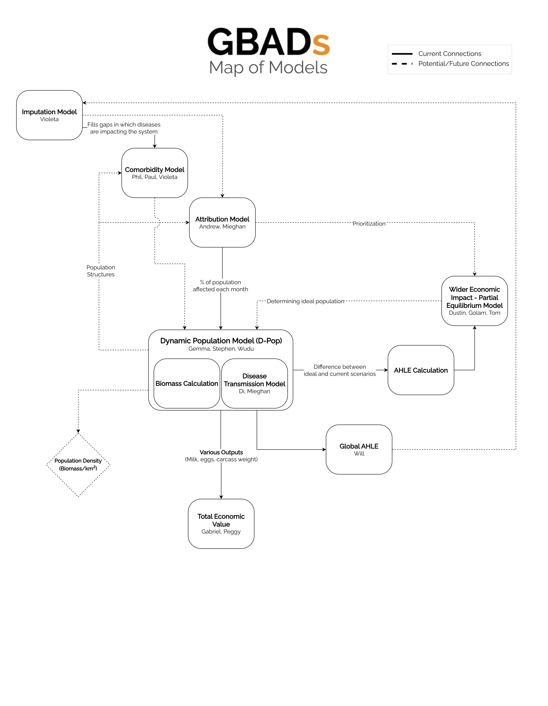

# Overview of GBADs Knowledge Engine and Data

## Map of Models

Diagram created by Kurtis Sobkowich

## GBADs KE Architecture 

This section outlines the GBADs Knowledge Engine (KE) Architecture, which is presented in the figure below. 

## Trusted Animal Information PortaL (TAIL)

