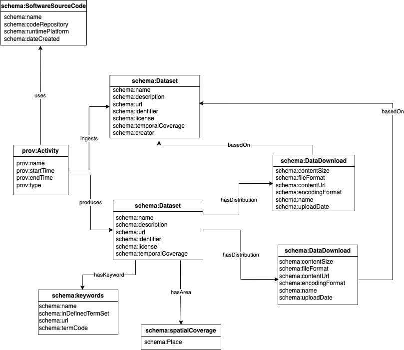

# Metadata 

Metadata is "data about data".

Metadata is used to store information about data assets that are stored in the GBADs knowledge engine. We strive for metadata to be FAIR (Findable, Accessible, Interoperable, and Reusable). 

In addition, we collect metadata on the processes in ingesting data into the Knowledge Engine to ensure that all data lineage is tracked. 


<!-- Technical data standards are an important element of the data governance strategy, as they ensure that data are Findable 
and Interoperable and that comparisons and mappings between different data sources can be established.
 
Standards for data, including metadata terms, attributes, structure and standardized naming conventions, enables data to 
be catalogued and insights to be drawn on data assets. For example, standard, well defined naming conventions allow for 
data to be queried. We are able to keep track of what types of data we have and in which areas more data is required. With 
standard vocabularies between data sources, mappings between sources can be created, allowing us to understand the relationship 
between data sources and provide insight on the quality and trustworthiness of these data sources. 
 
Technical data standards exist in each of the following categories: (meta)data structure, (meta)data content (vocabularies) 
and meta(data) format.  -->

## Metadata Schema 

"A metadata schema is a set of rules about what sorts of subject-predicate-object statements one is allowed to make, and how one is allowed to make them." - Jeffery Pomerantz

A subject-predicate-object statement consists of: 
* Subject = the thing being described
* Object = the thing describing the subject
* Predicate = relationship between the subject and object

For example: 
* Subject = FAOSTAT QCL dataset
* Object = FAO 
* Predicate = creator 

In this subject-predicate-object statement the FAO is the creator of the FAOSTAT QCL dataset. 

Based on this model, we can craete a metadata schema that defines the predicates (also called elements) that we would like to use to describe a resource. Metadata vocabularies such as [Dublin Core](https://www.dublincore.org/), [schema.org](https://schema.org/), [PROV-DM](https://www.w3.org/TR/prov-dm/), and [DCAT](https://www.w3.org/TR/vocab-dcat-2/) , provide metadata elements that can be used to describe data. There is not a 'one-size-fits-all' when it comes to metadata. Several standard metadata element sets exist because what you will include in metadata depends on what your use case is. 

We have selected metadata elements from schema.org and PROV-DM to describe data and trace data lineage in the knowledge engine (see Figure below). 



## Encoding Schema

Each metadata element should have instructions on the expected values expected for each element. For example, there are many different ways to specify a date: 01/04/23 could mean January 4th, 2023 or April 1st, 2023. Therefore, any values for any element specifying a date  should use [ISO-8601](https://www.iso.org/iso-8601-date-and-time-format.html) to ensure that all dates are formatted in a standard fashion. 

The encoding schema for each metadata element used in the metadataModel is found below: 

| Element | Encoding Scheme | Expected Type | 
| ------- | --------------- | --------------- |
| [name](https://schema.org/name) | free text | str |
| [codeRepository](https://schema.org/codeRepository) | link to GitHub repo | str |
| [runtimePlatform](https://schema.org/runtimePlatform) | name of programming language or platform used at runtime (need controlled vocabulary) | str |
| [dateCreated](https://schema.org/dateCreated) |[ISO-8601](https://www.iso.org/iso-8601-date-and-time-format.html) | datetime |
| [startTime](https://schema.org/startTime) |[ISO-8601](https://www.iso.org/iso-8601-date-and-time-format.html)| datetime  |
| [endTime](https://schema.org/endTime) |[ISO-8601](https://www.iso.org/iso-8601-date-and-time-format.html)| datetime |
| prov:type | Controlled vocabulary to be built for use case (*i.e* ingestionEvent, dataCleaning etc.)| str | 
| [description](https://schema.org/description) | free text | str| 
| [url](https://schema.org/url) | url | str | 
| [identifier](https://schema.org/identifier) | url, doi, or uri | str | 
| [license](https://schema.org/license) | url | str | 
| [temporalCoverage](https://schema.org/temporalCoverage) |[ISO-8601](https://www.iso.org/iso-8601-date-and-time-format.html) | datetime |
| [creator](https://schema.org/creator) | free text | str | 
| [inDefinedTermSet](https://schema.org/inDefinedTermSet) | url | str | 
| [termCode](https://schema.org/termCode) | code from defined term set | str | 
| [Place](https://schema.org/Place) | [GeoNames](https://www.geonames.org/)| str | 
| [contentSize](https://schema.org/contentSize) | File size in megabytes | float | 
| [fileFormat](https://schema.org/fileFormat) | File format. One of: csv, json, dbtable etc. (controlled vocabulary required) | str |
| [contentUrl](https://schema.org/contentUrl) | url | url | 
| [uploadDate](https://schema.org/uploadDate) | [ISO-8601](https://www.iso.org/iso-8601-date-and-time-format.html) | datetime |

--- 

Decision needed: 

Currently, keywords for metadata are created through extracting terms (like species), from data sets.

A controlled vocabulary needs to be created to link keywords to. We have begun to do this by collecting all species classifications and definitions from data sources, however, synonyms have not yet been identified. 

---

<!-- Metadata Content


To annotate metadata terms, standard vocabularies are employed (see Appendix D). For example, all dates reported in the metadata are...

Metadata Terms 


Metadata terms are adapted from the 
- [International System for Agricultural Science and Technology (AGRIS) Application Profile (AP)](http://www.fao.org/3/ae909e/ae909e05.htm#P460_23819)
- [Dublin Core Metadata Initiative (DCMI)](https://dublincore.org/specifications/dublin-core)
- [Agricultural Metadata Element Set (AgMES)](https://fairsharing.org/FAIRsharing.vd694s)
   - This standard has been deprecated although the FAO still cites it.

An index of metadata standards can be found at the [Metadata Standards Catalog](https://rdamsc.bath.ac.uk/scheme-index).

GBADs will further extend and refine terms to fulfill specific needs for the governance and provenance of data collected by or 
handled by the GBADs data portal system. 
## Metadata Structure

Metadata schemas will be stored in the [JSON-LD](https://json-ld.org/) format. JSON-LD is a structured data format that supports the implementation of linked data. Google’s [structured metadata tool](https://search.google.com/structured-data/testing-tool/) is used to test whether the output metadata is valid.

There are 3 main types of metadata, each serving a specific purpose in the lifecycle of the data (Riley, 2017) (Table 1). 

Descriptive metadata includes information about the data source used for finding and understanding a resource. This includes information about the context of the data, including information about provenance, if applicable. Descriptive metadata provides information that will allow for the data to be Findable and Interoperable. 

Administrative metadata includes two subsets of metadata: technical and rights metadata. Riley (2017) describes administrative metadata as metadata that are used for the management of a given data resource. Rights metadata provides information about the licensing and copyright information of a given source while technical metadata provides information about the file type and size of the data. Structural metadata describes the relationships between parts of resources to others. This might include information about how data are arranged or viewed, hierarchical relationships or the sequence of data objects. For the contexts of GBADs, structural metadata is also important in storing information about the Accessibility of private data sources.

Table 1: Types of metadata and definitions. Table adapted from Riley, 2017. 
| Type of Metadata | Definition | Example Properties | Primary Uses |
| --------------- | ---------- | ------------------ | ------------ |
| Descriptive metadata | For finding and understanding a resource; for data quality. | Title, Author, Subject, Genre, Publication Date | Findability, Display, Interoperability |
| - Administrative metadata- Technical metadata - Rights metadata | - For decoding and rendering files - Long term management of files - Intellectual property rights attached to content | Technical: file type, file size, creation date/time Rights: Copyright status, License terms, Rights holder | Interoperability, Digital object management, Preservation |
| Structural metadata | Relationships of parts of resources to one another. | Sequence, Place in hierarchy | Navigation |

Metadata can include different terms depending on the context of the source. Table 2 has a list of all possible terms that metadata 
could include as well as their URIs. When a metadata term is used, the URI of that term must be accounted for in the `@ context` section 
of the JSON-LD script. This allows for the definition of the term to be traced back to a standardized definition. 
 
Each data asset in the system must be at minimum described with the following terms (the first set of terms before the blank line in Table 2): URI, 
accessRights, accrualMethod, contributor, coverage, date, dateSubmitted, description, format, identifier, language, mediator, provenance, spatial, 
temporal, title, type, subjectThesaurus, subjectClassification. 
 
When data are modified by GBADs or are from the output of a model, this must be accredited in the metadata. In these cases, the following 
terms may be used: modified, alternative, replaces, isPartof, isFormat, hasFormat, hasPart, isRequiredBy, isVersionOf, hasVersion, provenance, 
requires. For example, in the scenario that GBADs has acquired a data asset that was changed from one vocabulary to another metadata terms 
isVersionOf, provenance, requires and modified would be used to reflect the changes.  -->

<!-- Table 2: All possible metadata terms and respective URIs. 

```json
{
  "@context": {
    "URI": "",
    "accessRights": "http://purl.org/dc/terms/accessRights",
    "accrualMethod": "http://purl.org/dc/terms/accrualMethod",
    "contributor": "http://purl.org/dc/terms/contributor",
    "coverage": "http://purl.org/dc/terms/coverage",
    "date": "http://purl.org/dc/terms/date",
    "dateSubmitted": "http://purl.org/dc/terms/dateSubmitted",
    "description": "http://purl.org/dc/terms/description",
    "format": "http://purl.org/dc/terms/format",
    "identifier": "http://purl.org/dc/terms/identifier",
    "language": "http://purl.org/dc/terms/language",
    "mediator": "http://purl.org/dc/terms/mediator",
    "provenance": "http://purl.org/dc/terms/provenance",
    "rights": "http://purl.org/dc/terms/rights",
    "spatial": "http://purl.org/dc/terms/spatial",
    "temporal": "http://purl.org/dc/terms/temporal",
    "title": "http://purl.org/dc/terms/title",
    "type": "http://purl.org/dc/terms/type",
"subjectThesaurus": "http://www.fao.org/3/ae909e/ae909e00.htm#TopOfPage#subjectThesaurus",
"subjectClassification": "http://www.fao.org/3/ae909e/ae909e00.htm#TopOfPage#subjectClassification",

    "accrualPeriodicity": "http://purl.org/dc/terms/accrualPeriodicity",
    "accrualPolicy": "http://purl.org/dc/terms/accrualPolicy", 
    "alternative": "http://purl.org/dc/terms/alternative",
    "audience": "http://purl.org/dc/terms/audience",
    "available": "http://purl.org/dc/terms/available",
    "bibliographicCitation": "http://purl.org/dc/terms/bibliographicCitation",
    "conformsTo": "http://purl.org/dc/terms/conformsTo",
    "created": "http://purl.org/dc/terms/created",
    "creator": "http://purl.org/dc/terms/creator",
    "dateAccepted": "http://purl.org/dc/terms/dateAccepted",
    "dateCopyrighted": "http://purl.org/dc/terms/dateCopyrighted",
    "extent": "http://purl.org/dc/terms/extent",
    "hasFormat": "http://purl.org/dc/terms/hasFormat",
    "isFormatOf": "http://purl.org/dc/terms/isFormatOf",
    "hasPart": "http://purl.org/dc/terms/hasPart",
    "isPartOf": "http://purl.org/dc/terms/isPartOf",
    "hasVersion": "http://purl.org/dc/terms/hasVersion",
    "isVersionOf": "http://purl.org/dc/terms/isVersionOf",
    "isReferencedBy": "http://purl.org/dc/terms/isReferencedBy",
    "replaces": "http://purl.org/dc/terms/replaces",
    "isReplacedBy": "http://purl.org/dc/terms/isReplacedBy",
    "requires": "http://purl.org/dc/terms/requires",
    "isRequiredBy": "http://purl.org/dc/terms/isRequiredBy",
    "license": "http://purl.org/dc/terms/license",
    "modified": "http://purl.org/dc/terms/modified",
    "references": "http://purl.org/dc/terms/references",
    "rightsHolder": "http://purl.org/dc/terms/rightsHolder",
    "source": "http://purl.org/dc/terms/source",
    "subject": "http://purl.org/dc/terms/subject",
    "tableOfContents": "http://purl.org/dc/terms/tableOfContents"
  }
``` -->

<!-- Rich metadata with terms describing the process of how the original data was obtained, recorded and collected provides context  -->
<!-- about the data quality and which data sources can be combined with others. Table 3 provides metadata terms that were adapted 
from GATHER guidelines. When a data contributor provides a data source, they will be required to fill out a form to provide 
context about the data provided. The responses on the form will generate the descriptive metadata for that data source. The 
terms that are used to describe data assets will depend on the nature of the data source; for example, not all data sources 
will contain information about disease. 

As more metadata is created, controlled vocabularies will be created or adapted for each term.  -->

<!-- Table 3: Metadata terms and definitions adapted from GATHER guidelines

| Term | Definition |
| :--- | ---------: |
| species | Species classification of organism  |
| disease | If based on reported disease, provide diseases that were included in study |
| inclusionCriteria | Demographic, clinical or geographic inclusion |
| exclusionCriteria | Demographic, clinical, or geographic exclusion |
| dataCollectionMethod | How was data collected? Survey? Field study?  |
| ageRange | Age of study subjects. |
| sex | Provide sex(es) of species included. |
| sampleSize | Sample size |
| measurementMethod | How the outcome of interest was measured. |
| diagnosticCriteria | How the disease was diagnosed.  |
| definedBias | Identify and describe any categories of input data that have potentially important biases. |
| fileFormat | Format of data file (csv, json etc.)  |
| analysisMethod | How the outcome of interest was analyzed - should also provide link to GitHub if applicable  |
| studyDesign | Information about research design. Terms such as cohort study, randomized trial, cost benefit analysis, descriptive study, diagnostic study etc. are expected.  |
| | | -->

## Metadata Storage and Management 

> "All the knowledge is in connections"
>
> -- [David Rumelhart](https://en.wikipedia.org/wiki/David_Rumelhart) 

GBADs Informatics uses [neo4j](https://neo4j.com/), a graph database management system, to manage and storage metadata and information about individuals and groups involved in the project. As you will learn in this section, a graph database is a type of database that leverages the idea of connections between entites as a method to derive insights and new knowledge from otherwise disconnected data.  

### What is a graph database? 

A graph database is a type of database that stores data using relationships between main ideas or entities. The relationships between different entities show connectedness, allowing for more insights to be drawn than a traditional relational database. Because data is highly complex and multidimensional in terms of structure, provenance, governance, security and semantics, GBADs uses graph databases for master metadata management and data cataloguing. By leveraging the dynamic nature of the graph database and structuring our **graph model** in a way that enables improved understanding of the many dimensions of data, we can both visualize and understand how data flows outside and inside our organization. Graph databases also allow us to add and change the structure as the structure of the information about data changes. This will become more clear as we introduce the preliminary GBADs graph data model. 

---
 
Traditionally, data are organized into a series of tables. Each of the tables have columns, and some tables have common columns. With these common columns you can specify joins between tables, resulting in a new table. 

The biggest advantage of relational databases is the ability to join common tables to derive insights. On the other hand, relational databases require rigid schemas which require database engineers to structure their data to fit the schema. This comes with the assumption that we know what all of our data already looks like, which isn't always the case for research.  

---


### Parts of a graph database

Graph databases are made up of **nodes** (entities) and **edges** (relationships). Nodes can have properties and labels while edges serve as the connection, or relationship between nodes. 

A graph model is a model of what kinds of nodes you are representing and how they are connected (what relationships you will have).


  d
<!---## GBADs graph database use cases--->

<!---GBADs uses graph databases for 2 main purposes:
1. Master metadata management
2. Management information system (MIS) --->

## Graph Database and Metadata API 

**To be updated when API is launched**