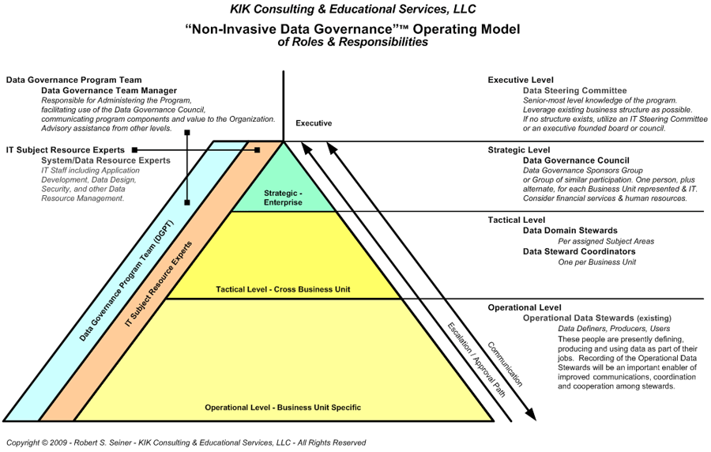

# Data Governance-Betriebsmodell

Ein Data-Governance-Betriebsmodell ist ein Betriebsmodell, das die wichtigsten Datenprozesse einer Organisation, die an jedem dieser Prozesse beteiligten Rollen und Aufgaben sowie die Personen, Tools und Technologien definiert, die zur Erfüllung jedes dieser Prozesse erforderlich sind.

---

**In diesem Abschnitt:**

* Wir skizzieren die Datenziele für GBADs
* Wir skizzieren das Daten-Governance-Betriebsmodell für GBADs anhand der Governance-Struktur (Arbeitsgruppen) der GBADs, um die Rollen und Verantwortlichkeiten für jede der Aufgaben zu verstehen, die zur Erfüllung der Datenziele erforderlich sind

---

## Ziele

Die wichtigsten Datenziele für GBADs lassen sich wie folgt unterteilen:

**Allgemein**

Datenziel 1.
Zugang zu Technologien und Produkten, die innovativ sind und den Stand der Technik vorantreiben.

**Daten**

Datenziel 2.
Identifizieren Sie Datenquellen, die für GBADs-Modellierungszwecke erforderlich sind

* Erstellen Sie bei Bedarf Datenallianzen mit privaten und öffentlichen Dateninhabern

Datenziel 3.
Daten sind für Benutzer (sowohl Menschen als auch Maschinen) zugänglich und können zeitnah zur Entscheidungsfindung genutzt werden [^1]

* Dazu gehören Daten, die GBADs von anderen Organisationen weiterleitet, und Daten, die GBADs für verbundene Projekte und Partner speichert [^1].

Datenziel 4.
Die Daten wurden auf Qualität analysiert und diese Messwerte sind als Teil der Metadaten verfügbar [^1]

Datenziel 5.
Daten werden nur einmal bereinigt – reduzieren Sie die Replikation von Datenquellen und die Bereinigung

Datenziel 6.
Daten sind für Datennutzer auffindbar [^1]

Datenziel 7.
Ein System, das die individuelle Anpassung von Informationen durch Mechanismen und Verarbeitung ermöglicht, die die Granularität der Daten an die Bedürfnisse des Benutzers anpasst[^1]

Datenziel 8.
Daten, die interpretierbar sind – die Semantik, die in Metadaten und anderen semantischen Systemen kodiert werden soll [^1]

**Modelle und Datenvisualisierungen**

Datenziel 9.
Modellierungsverfahren sind reproduzierbar

Datenziel 10.
Die Datenherkunft wird nachverfolgt, um sicherzustellen, dass alle Datenverfahren replizierbar sind, um sicherzustellen, dass Daten nicht repliziert werden, um die Datenqualität und -aktualisierungen zu unterstützen und um den Überblick darüber zu behalten, welche Datenversionen in Veröffentlichungen verwendet werden

Datenziel 11.
Datenvisualisierungen und Dashboards werden auf GBADs-Servern bereitgestellt, nutzen Daten aus der GBADs Knowledge Engine (GBADs-Datenquellen) und verknüpfen sie mit Metadaten und Methoden

Data-Governance-Verfahren und -Prozesse sind von entscheidender Bedeutung, um die Ziele zu erreichen, ein FAIR(S)-System zu schaffen und sicherzustellen, dass Datenprozesse, Veröffentlichungen und Modelle reproduzierbar sind. Jedes Ziel hat seine eigenen Prozesse, die einzigartige technologische Werkzeuge und individuelle (menschliche) Verantwortlichkeiten aus dem Informatik-Thema erfordern, und andere, die Datenmodelle in GBADs verwenden und erstellen. Die Governance-Struktur (Arbeitsgruppen) des GBAD bietet einen Ausgangspunkt für das Verständnis, wo die Verantwortung in der Betriebsstruktur der Daten-Governance liegt.

<!--
Von FAIR zu FAIRS
Daten, die zeitnah zur Entscheidungsfindung genutzt werden können.
Daten, die auf Qualität analysiert wurden, und diese Metriken sind als Teil der Metadaten verfügbar.
Eine möglichst vollständige Datenerfassung für alle Beteiligten. Dazu gehören Daten, die GBADs von anderen Organisationen weiterleitet, und Daten, die GBADs für verbundene Projekte und Partner speichert.
Daten, die für die Modellierung, Entscheidungsunterstützung und andere Zwecke relevant sind, die für die Ziele von GBADs und seinen Benutzern wichtig sind.
Daten, die für entsprechende Benutzer (sowohl Maschinen als auch Menschen) leicht zugänglich sind.
Daten, die interpretierbar sind – die Semantik, die in Metadaten und anderen semantischen Systemen kodiert werden soll.
Zugang zu Technologien und Produkten, die innovativ sind und den Stand der Technik vorantreiben.
Ein System, das die individuelle Anpassung von Informationen durch Mechanismen und Verarbeitung ermöglicht, die die Granularität der Daten an die Bedürfnisse des Benutzers anpasst. ->

<!-- * Bewerten Sie die Qualität aller Eingabedaten anhand der vom Informatikteam festgelegten Qualitätsmetriken und kommunizieren Sie die Qualität über Datenqualitätsberichte oder Dashboards
* Daten können über Anwendungsprogrammierschnittstellen (APIs) und/oder Dateien in S3-Buckets mit internen und externen Partnern geteilt werden
* Reduzieren Sie die Datenreplikation und stellen Sie Prozesse bereit, damit alle Datenbenutzer in GBADs dieselben Datenversionen verwenden können
* Verfolgen Sie die Datenherkunft und -herkunft, um sicherzustellen, dass Änderungen an Daten und Ausgaben reproduzierbar und nachvollziehbar sind, und um dies sicherzustellen
* Stellen Sie sicher, dass die Modellierungsverfahren gut dokumentiert sind.
* Bereitstellung von Infrastruktur für

Die Ziele wurden anhand des Investitionsdokuments 2023 formuliert. ->

## Menschen und Prozesse – GBADs Arbeitsgruppen

GBADs ist in drei Hauptarbeitsgruppen unterteilt, jede mit einzigartigen, aber sich überschneidenden Verantwortlichkeiten. Arbeitsgruppen werden mit jedem Gebäude übereinander organisiert, in dem die Daten als Rückgratstruktur liegen (Abbildung 1).

Abbildung 1: GBADs-Arbeitsgruppen

Jede Arbeitsgruppe hat eine Reihe von Verantwortlichkeiten, die in den GBADs festgelegt sind, um das Ziel zu erreichen, die wirtschaftliche und gesundheitliche Belastung durch Tierkrankheiten durch Modellierungsbemühungen abzuschätzen. Die beschriebenen Verantwortlichkeiten überschneiden sich mit den Datenzielen des GBAD durch Interaktionen mit der Beschaffung, Nutzung und Verwaltung von Daten. Die folgende Tabelle enthält eine Beschreibung der Verantwortlichkeiten für jede Arbeitsgruppe und welche Ziele für jede Arbeitsgruppe gelten:

| Arbeitsgruppe | Beschreibung der Verantwortlichkeiten[^2] | Überschneidung mit Zielen |
| ------------- | ----------- | ----------- |
| Arbeitsgruppe 1 (WG1) – Datenallianzen, Informationsvermittlung und Annahme und Aufnahme | <ul><li>Förderung einer effektiven Forschungsübersetzung und wird auf der Arbeit zum Thema Krankheitspriorisierung im globalen Kontext und auf der Einbindungsarbeit mit Interessenvertretern der indonesischen und äthiopischen Fallstudien in einem lokalen Kontext aufbauen.</li>< li>Forschung in wertvolle Produkte umsetzen, um auf weitere Ressourcen zuzugreifen, sei es Daten, Finanzmittel oder Sachleistungen aus anderen Programmen.</li><li>Verantwortlich für die Kombination und Organisation der Analyseergebnisse für Konsistenz und Verständnis durch die Benutzer und den Willen Seien Sie dafür verantwortlich, sicherzustellen, dass das Feedback von Benutzern und Experten-Referenzgruppen in Dashboards integriert wird.</li></ul>| <ul><li>[Datenziel 2](#Data-Goal-2)</li></ul>|
| Arbeitsgruppe 2 (WG2) Methoden und Analytik | <ul><li>Verantwortlich für die Verfeinerung der GBAD-Methoden, die eine qualitativ hochwertige Datenanalyse und wissenschaftliche Modellierung liefern, wobei Szenarioanalysen zur Bewältigung von Datenverfügbarkeitsbeschränkungen und Sensitivitätsanalysen zur Einbeziehung von Datenqualitätsbeschränkungen verwendet werden, eine entscheidende Grundlage für die Wissensmaschine und die Gültigkeit von Krankheiten Belastungsschätzungen.</li><li>Verwenden Sie Teilmengen von Daten aus der von der Informatik-Arbeitsgruppe (WG3) erstellten Obermenge mit Transformationen und Berechnungen, die für spezifische Analysen erforderlich sind.</li><li>Verantwortlich für die Bewertung der technischen Machbarkeit von GBADs indem es die wissenschaftliche Relevanz und Robustheit seiner Methoden testet.</li></ul> | <ul><li>[Datenziel 2](#Data-Goal-2)</li><li>[Datenziel 4](#Data-Goal-4)</li><li>[Datenziel 9 ](#Data-Goal-9)</li><li>[Datenziel 10](#Data-Goal-10)</li></ul>|
| Arbeitsgruppe 3 (WG3) – Informatik | <ul><li>Verantwortlich für den Prototypenaufbau der Wissensmaschine, der eine Grundlage verwalteter Daten liefert – eine Obermenge von Daten mit Governance-Regeln und Standardbereinigungsprozessen.</li></ul> | <ul><li>[Datenziel 1](#Data-Goal-1)</li><li>[Datenziel 3](#Data-Goal-3)</li><li>[Datenziel 4 ](#Data-Goal-4)</li><li>[Datenziel 5](#Data-Goal-5)</li><li>[Datenziel 6](#Data-Goal-6)< /li><li>[Datenziel 7](#Data-Goal-7)</li><li>[Datenziel 8](#Data-Goal-8)</li><li>[Datenziel 10 ](#Data-Goal-10)</li><li>[Data Goal 11](#Data-Goal-11)</li></ul>|

---

Das Data-Governance-Betriebsmodell nutzt die Arbeitsgruppenstruktur, um Rollen und Verantwortlichkeiten im Zusammenhang mit den Datenzielen zuzuweisen.

---

<!-- ## Nicht-invasives Daten-Governance-Betriebsmodell von Rollen und Verantwortlichkeiten

Das nicht-invasive Data Governance-Betriebsmodell von Rollen und Verantwortlichkeiten

 -->

## Verweise:
[^1] https://acsess.onlinelibrary.wiley.com/doi/full/10.1002/agj2.21017?af=R
[^2] Arbeitsgruppen und Beschreibung der Verantwortlichkeiten entnommen aus dem GBADs Bill und dem Melinda Gates Investment Document 2022
[^3] https://tdan.com/the-non-invasive-data-governanceo-operating-model/12210
