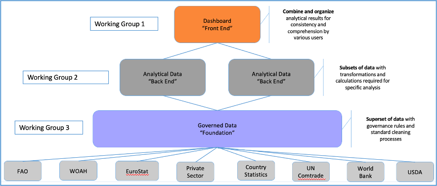
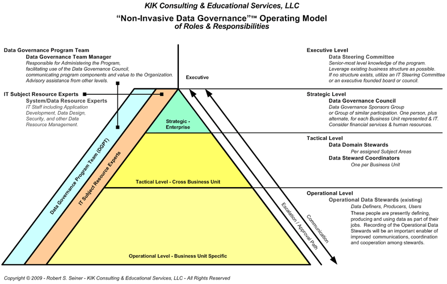

# Modelo operativo de gobernanza de datos

Un modelo operativo de gobierno de datos es un modelo operativo que define los procesos de datos clave de una organización, los roles y tareas involucrados en cada uno de esos procesos, y las personas, herramientas y tecnología que se requieren para cumplir con cada uno de los procesos.

---

**En esta sección:**

* Describimos los objetivos de datos para GBAD
* Delineamos el modelo operativo de gobierno de datos para GBAD utilizando la estructura de gobierno de los GBAD (Grupos de Trabajo) para comprender los roles y responsabilidades de cada una de las tareas involucradas para cumplir con los objetivos de datos.

---

## Objetivos

Los principales objetivos de datos de los GBAD se pueden dividir en los siguientes:

**General**

Objetivo de datos 1.
Acceso a tecnología y productos que son innovadores y avanzan en lo último en tecnología.

**Datos**

Objetivo de datos 2.
Identificar las fuentes de datos necesarias para fines de modelado de GBAD.

* Cuando sea necesario, crear alianzas de datos con titulares de datos públicos y privados.

Objetivo de datos 3.
Los datos son accesibles para los usuarios (tanto humanos como máquinas) y pueden utilizarse en el momento oportuno para la toma de decisiones [^1]

* Esto incluye datos que GBADs redirige desde otras organizaciones y datos que GBADs almacena para proyectos y socios asociados [^1].

Objetivo de datos 4.
Se ha analizado la calidad de los datos y estas métricas están disponibles como parte de los metadatos [^1]

Objetivo de datos 5.
Los datos se limpian solo una vez: reduzca la replicación de fuentes de datos y la limpieza

Objetivo de datos 6.
Los datos pueden ser encontrados por los usuarios de datos [^1]

Objetivo de datos 7.
Un sistema que permite la personalización de la información a través de mecanismos y procesamiento que ajusta la granularidad de los datos a las necesidades del usuario[^1]

Objetivo de datos 8.
Datos que son interpretables: la semántica que se codificará en metadatos y otros sistemas semánticos [^1]

**Modelos y visualizaciones de datos**

Objetivo de datos 9.
Los procedimientos de modelado son reproducibles.

Objetivo de datos 10.
Se rastrea el linaje de datos para garantizar que todos los procedimientos de datos sean replicables, para garantizar que los datos no se repliquen, para ayudar con la calidad y las actualizaciones de los datos, y para realizar un seguimiento de qué versiones de datos se utilizan en las publicaciones.

Objetivo de datos 11.
Las visualizaciones de datos y los paneles se sirven en servidores de GBAD, utilizan datos del motor de conocimiento de GBAD (fuentes de datos de GBAD) y se vinculan a metadatos y métodos.

Los procedimientos y procesos de gobernanza de datos son cruciales para cumplir los objetivos, crear un sistema que sea FAIR(S) y garantizar que los procesos, publicaciones y modelos de datos sean reproducibles. Cada objetivo tiene sus propios procesos que requieren herramientas tecnológicas únicas y responsabilidades individuales (humanas) del tema Informática, y otras que utilizan y crean modelos de datos en GBAD. La estructura de gobernanza de los GBAD (Grupos de Trabajo) proporciona un punto de vista para comprender dónde reside la responsabilidad en la estructura operativa de gobernanza de datos.

<!--
De FERIA en FERIAS
Datos que pueden ser utilizados de manera oportuna para la toma de decisiones.
Datos cuya calidad se ha analizado y estas métricas están disponibles como parte de los metadatos.
Una recogida de datos lo más completa posible para todos sus grupos de interés. Esto incluirá datos que GBADs redirige desde otras organizaciones y datos que GBADs almacena para proyectos y socios asociados.
Datos que son relevantes para el modelado, el apoyo a la toma de decisiones y otros fines importantes para los objetivos de GBAD y sus usuarios.
Datos que sean fácilmente accesibles para los usuarios apropiados (tanto máquinas como humanos).
Datos que son interpretables: la semántica que se codificará en metadatos y otros sistemas semánticos.
Acceso a tecnología y productos que son innovadores y avanzan en lo último en tecnología.
Un sistema que permite la personalización de la información mediante mecanismos y procesamientos que ajustan la granularidad de los datos a las necesidades del usuario. -->

<!-- * Evaluar la calidad de todos los datos de entrada de acuerdo con las métricas de calidad establecidas por el equipo de Informática y comunicar la calidad a través de informes o paneles de calidad de los datos.
* Los datos se pueden compartir con socios internos y externos a través de interfaces de programación de aplicaciones (API) y/o archivos en depósitos de S3.
* Reducir la replicación de datos y proporcionar procesos para que todos los usuarios de datos puedan utilizar las mismas versiones de datos en GBAD
* Rastree el linaje y la procedencia de los datos para garantizar que los cambios en los datos y los resultados sean reproducibles y rastreables, y para garantizar que
* Asegurar que los procedimientos de modelado estén bien documentados,
* Proporcionar infraestructura para

Los objetivos se redactaron utilizando el Documento de Inversión 2023. -->

## Personas y Procesos - Grupos de Trabajo GBADs

GBADs se divide en tres grupos de trabajo principales, cada uno con responsabilidades únicas pero superpuestas. Los grupos de trabajo se organizan con cada edificio uno encima del otro, donde los datos se encuentran como estructura principal (Figura 1).

Figura 1: Grupos de trabajo de GBAD

Cada grupo de trabajo tiene un conjunto de responsabilidades, según lo descrito por los GBAD, para cumplir el objetivo de estimar la carga económica y sanitaria de las enfermedades animales mediante esfuerzos de modelización. Las responsabilidades descritas se superponen con los objetivos de datos del GBAD a través de interacciones con la obtención, el uso y la gestión de datos. La siguiente tabla describe la descripción de las responsabilidades de cada grupo de trabajo y qué objetivos pertenecen a cada grupo de trabajo:

| Grupo de Trabajo | Descripción de responsabilidades[^2] | Superposición con objetivos |
| --- | --- | --- |
| Grupo de Trabajo 1 (WG1) - Alianzas de datos, Comunicación de información y Adopción y aceptación | Impulsará la traducción efectiva de la investigación y se basará en el trabajo del tema de priorización de enfermedades en el contexto global y en el trabajo de participación con las partes interesadas de los estudios de caso de Indonesia y Etiopía en un contexto local. Traducir la investigación en productos valiosos para acceder a más recursos, ya sean datos, financiación o contribuciones en especie de otros programas. Responsable de combinar y organizar los resultados analíticos para lograr coherencia y comprensión por parte de los usuarios y será responsable de garantizar que los comentarios de los usuarios y del grupo de referencia de expertos se incorporen en los paneles. | [Objetivo de datos 2](#Objetivo-datos-2) |
| Grupo de Trabajo 2 (WG2) - Métodos y análisis | Responsable del refinamiento de los métodos GBAD que brindan análisis de datos y modelado científico de alta calidad, utilizando análisis de escenarios para abordar las limitaciones de disponibilidad de datos y análisis de sensibilidad para incorporar limitaciones de calidad de los datos, una base crítica para el motor de conocimiento y la enfermedad válida. Utilice subconjuntos de datos del superconjunto creado por el Grupo de Trabajo de Informática (WG3) con las transformaciones y cálculos necesarios para análisis específicos. Responsable de evaluar la viabilidad técnica de los GBAD probando la relevancia científica y la solidez de sus métodos. | [Objetivo de datos 2](#Objetivo-datos-2) [Objetivo de datos 4](#Objetivo-datos-4) [Objetivo de datos 9](#Objetivo-datos-9) [Objetivo de datos 10](#Objetivo-datos-10) |
| Grupo de Trabajo 3 (WG3) - Informática | Responsable de la construcción del prototipo del motor de conocimiento, entregando una base de datos gobernados: un superconjunto de datos con reglas de gobierno y procesos de limpieza estándar. | [Objetivo de datos 1](#Objetivo-datos-1) [Objetivo de datos 3](#Objetivo-datos-3) [Objetivo de datos 4](#Objetivo-datos-4) [Objetivo de datos 5](#Objetivo-datos-5) [Objetivo de datos 6](#Objetivo-datos-6) [Objetivo de datos 7](#Objetivo-datos-7) [Objetivo de datos 8](#Objetivo-datos-8) [Objetivo de datos 10](#Objetivo-datos-10) [Objetivo de datos 11](#Objetivo-datos-11) |

---

El modelo operativo de gobernanza de datos utiliza la estructura del grupo de trabajo para asignar roles y responsabilidades relacionadas con los objetivos de los datos.

---

<!-- ## Modelo operativo de funciones y responsabilidades de gobernanza de datos no invasivos

El modelo operativo de funciones y responsabilidades de gobernanza de datos no invasivos

 -->

## Referencias:
[^1] https://acsess.onlinelibrary.wiley.com/doi/full/10.1002/agj2.21017?af=R
[^2] Grupos de trabajo y descripción de responsabilidades extraída del Documento de inversión de GBADs Bill y Melinda Gates 2022
[^3] https://tdan.com/the-non-available-data-governanceo-operating-model/12210
