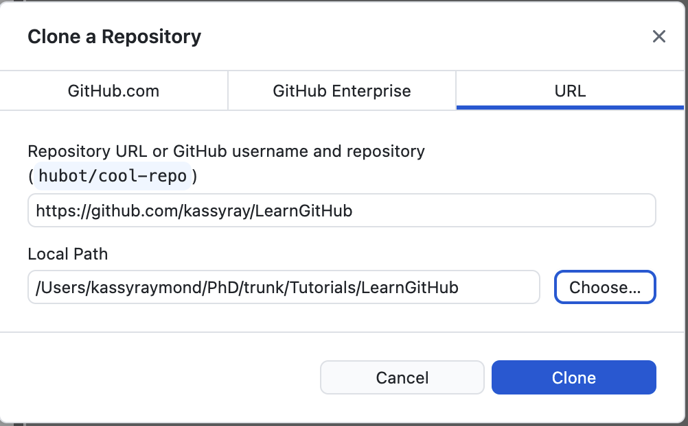

# Materiales educativos y mejores prácticas

## Mejores prácticas para la codificación

Los miembros de GBAD utilizan con mayor frecuencia R y Python para codificar, limpiar y organizar datos, y construir sus modelos. Las mejores prácticas para las convenciones de codificación permiten que el código sea legible y reutilizable. Estas son las mejores prácticas que GBADs Informatics y modeladores sugieren para garantizar que podamos comprender y utilizar el código.


<!---

James y Gemma: esta área está comentada en el archivo de rebajas. Cuando ves 'advertencia' en el texto, ¡solo significa que aparece un pequeño cuadro que no es!

· ¿Comentar con el nombre del creador, la fecha (en formato ISO 8601? Por ejemplo, 20210729), qué contiene el script (por ejemplo, análisis de componentes principales).

· Bibliotecas cargadas en el script R

· ¿Establecer directorio de trabajo?

· Los datos deben estar "ordenados" al final del proceso de limpieza (consulte el Manual de gobernanza de datos o R para ciencia de datos)

· Organiza los datos de izquierda a derecha con variables categóricas y luego variables continuas. ¿Se deben agrupar las variables cuando sean relevantes (por ejemplo, densidad de población en el momento del aclareo, peso al momento del aclareo, fecha del aclareo, etc.)?

· Eliminar columnas irrelevantes del conjunto de datos (por ejemplo, longitud y latitud)

· Código bien documentado

· Utilice una convención de nomenclatura de archivos estándar (por ejemplo, 20210617_FAO_ProductionPrices_Poultry_Ethiopia_metadata.csv, NO Precios de producción de la FAO, descargado por Kassy el 25 de abril.csv)

· Serpiente para nombrar objetos en R (por ejemplo, Majority_Parent_Flock_Old)

· Los objetos deben tener un nombre significativo


--->

### Mejores prácticas de codificación R

#### 1. Convenciones de nomenclatura

**Nombre de archivo**

Se utilizan convenciones de nomenclatura estándar para el nombre del archivo y para todas las variables y funciones definidas en su código.

Los nombres de los archivos deben seguir el formato `dateOfCreation_meaningfulCodeName.R`.

Por ejemplo, si mi código limpia y reformatea datos de ganado, podría llamar a mi script "20210703_faoLivestockProductionDataCleaning.R".

---

Se trata más sobre nuestra convención de fecha y hora estándar en [convención de fecha y hora estándar](https://gbadskedoc.org/docs/Data-Governance-Handbook-for-GBADs/educationalMaterials#standard-date-and-time-convention )

---

**Denominación de variables**

Utilice `snake_case` para nombrar variables y funciones en su código. El uso de una convención de nomenclatura estandarizada mejora la legibilidad e interpretación del código.

<!--También se deben utilizar convenciones de nomenclatura al declarar variables o crear funciones. Si bien existen múltiples convenciones de nomenclatura populares, incluidas camelCase, PascalCase y Snake_case, por ejemplo, la convención acordada para GBAD es el uso de Snake_case. -->

Utilice nombres significativos al nombrar variables y funciones. El nombre del objeto debe reflejar su utilidad o características. Por ejemplo, si estás leyendo en un marco de datos de producción ganadera:

```
ganado_df <- read_csv('ruta/a/mi/importante/archivo.csv')
```

```{admonition} Tenga cuidado al configurar el directorio de trabajo
Recuerde que cuando usa `setwd()` para configurar el directorio de trabajo para su proyecto o script, el directorio de trabajo es distinto de su computadora y puede disminuir el nivel de reproducibilidad de su código.
```

#### 2. Organiza el formato de tu código

Comience su secuencia de comandos con el nombre del creador, la fecha en que se editó por última vez (en ISO 8601) y una breve descripción del propósito de la secuencia de comandos.

```
####################################
# Creador: Kassy Raymond
# Correo electrónico: kraymond@uoguelph.ca
# Fecha de última edición: 20210803

# Este programa contiene código que realiza análisis de componentes principales (PCA)
# sobre datos de producción ganadera de Etiopía. Los datos que se utilizaron en este
# programa proviene del conjunto de datos de producción de FAOSTAT y se descargó en
# 2021-08-03. Los datos de salida de este script se utilizarán en un modelo que
# calcula la biomasa.

####################################
```

Documente su código con comentarios para que el lector de su código (o usted en el futuro) pueda seguir cada paso que tomó en su script.

Cargue todas las bibliotecas al comienzo de su programa. En R, esto podría verse así:

```
## 0 - Cargar en todas las bibliotecas

biblioteca (tidyverse)
biblioteca (ggplot2)
biblioteca (tejedor)
biblioteca (lector)
biblioteca (forcats)
biblioteca (dplyr)
```

Cuando sea posible, segmente su código en secciones. Esto ayuda con la reproducibilidad y hace que el código sea más legible.

```
## 0 - Cargar en todas las bibliotecas

biblioteca (tidyverse)
biblioteca (ggplot2)
biblioteca (tejedor)
biblioteca (lector)
biblioteca (forcats)
biblioteca (dplyr)

## 1 - Archivos fuente

ruta_datos <- 'ruta/a/mi/importante/archivo.csv'
ganado_df <- read_csv(ruta_datos)

## 2 - Limpieza de datos

# Eliminar columnas innecesarias

# Verificar NA

# Explore datos y compruebe si hay valores atípicos o errores en los datos

## 3 - Modelado

```

#### 3. Limpieza de datos

##### 3.1 Elimine las columnas innecesarias al principio de su código

Si no está utilizando una columna en un análisis posterior, colóquela en la fase de exploración y limpieza de datos de su secuencia de comandos. Esto mejorará la interpretabilidad de su código y aumentará la velocidad de procesamiento de su programa.

##### 3.2 Recordar la procedencia de los datos

Es importante que se puedan reproducir las estimaciones, los modelos, los gráficos y los conjuntos de datos de salida creados por los modelos. Por lo tanto, es importante incluir el conjunto de datos original utilizado o, cuando se utilizan API, la capacidad de rastrear hasta el conjunto de datos original.

Si descargó sus datos, asegúrese de guardar una copia del conjunto de datos original y **no sobrescribir** esto en su flujo de trabajo.

Si se realizó una llamada a la API para obtener los datos, asegúrese de que la marca de fecha de esa llamada se proporcione en el nombre del conjunto de datos de salida, los modelos o los gráficos que se crean. También puede volver a elegir guardar una copia del conjunto de datos original.

##### 3.3 Asegúrese de que los datos estén en un formato "ordenado" al final de la fase de limpieza de datos

Consulte también Organización de hojas de cálculo en estos materiales educativos y [R para ciencia de datos](https://r4ds.had.co.nz/) de Hadley Wickham.

##### 3.4 Organizar datos

Organice los datos de izquierda a derecha con variables categóricas y luego variables continuas. Las variables deben agruparse cuando sean relevantes (por ejemplo, densidad de población en el momento del entresaque, peso en el momento del entresaque, fecha del entresaque, etc.)

#### 4. Otras recomendaciones

- ¡Pruebe RStudio para su IDE!


## Organización de datos en hojas de cálculo

> "Basura entra, basura sale"

Si estás leyendo esto, probablemente dediques mucho tiempo a tratar con datos. Puedes recopilarlo, limpiarlo, modelarlo, compartirlo, intentar interpretarlo y luego volver a hacerlo todo. Cuando recibe datos de un colega, puede intentar limpiarlos nuevamente (incluso si ya se han limpiado), intentar interpretarlos e incluso puede que tenga que escribir varios correos electrónicos para interpretar los datos.

**En esta parte del manual, le explicamos cómo puede organizar mejor sus datos en hojas de cálculo para crear datos de mayor calidad, lo que conducirá a modelos de mayor calidad. También definimos algunas prácticas estándar para ingresar datos de tipos específicos, incluidas fechas y números largos.**

### Hojas de cálculo y conjuntos de datos

Las hojas de cálculo, como las creadas en Microsoft Excel y Google Sheets, son comunes para almacenar, ingresar, compartir y manipular datos de investigación. Las hojas de cálculo se comparten comúnmente para comunicar resultados de investigaciones y se utilizan como datos de entrada para modelos o análisis estadísticos. Si bien las hojas de cálculo son una parte integral del ciclo de vida de los datos, deben estructurarse adecuadamente para garantizar que no se cometan errores que impidan que los datos se puedan reutilizar o interpretar. Los pequeños errores en las hojas de cálculo pueden llevarnos a situaciones en las que los datos son difíciles de entender, de analizar y su limpieza requiere mucho tiempo.

---
**NOTA**

¡Comuníquese con el equipo de informática de GBAD si es miembro de GBAD y tiene muchas hojas de cálculo con datos "desordenados"! ¡Podemos consultar y pensar en cómo crear un programa que discuta y transforme sus datos en un formato ordenado!

---

La estructuración adecuada de los datos en hojas de cálculo hace que los datos sean más reutilizables e interoperables (FAIR), lo que genera datos de mayor calidad y, en última instancia, una mejor investigación. Al configurar hojas de cálculo para ser ingeridas en softwares o bibliotecas estadísticas desde el principio, podemos minimizar la confusión y simplificar nuestros flujos de trabajo.

---

Objetivos de aprendizaje
* Los lectores deben comprender cómo estructurar un conjunto de datos en una hoja de cálculo de manera que respalde los principios de datos FAIR.
* Los lectores deben comprender cómo estructurar su conjunto de datos para preservar la semántica (significado subyacente) de los datos.
* Los lectores deben comprender cómo estructurar fechas y números largos en hojas de cálculo y por qué es importante que estos datos sean legibles por máquina.
* Los lectores deben comprender los errores comunes que generan conjuntos de datos confusos y cómo evitarlos.

---

### Estructura de datos


> "Los conjuntos de datos ordenados son todos iguales, pero cada conjunto de datos desordenado lo es a su manera".

> -- [Hadley Wickham](http://hadley.nz/)


En general, un conjunto de datos ordenado o limpio se compone de lo siguiente [^1]:


**Columnas (Variables)**

* Las columnas son un grupo de celdas alineadas verticalmente. En los conjuntos de datos, las columnas son variables, donde cada celda contiene información sobre un atributo determinado.

**Filas (Observaciones)**

* Las filas son un grupo de celdas que están alineadas horizontalmente, donde cada fila es una observación.

**Celdas (Valores)**

* En los conjuntos de datos, cada fila es una observación y cada celda de esa fila contiene el valor de la columna donde cae.


Reglas que crean un conjunto de datos ordenado: las columnas son variables, las observaciones son filas y los valores son celdas. Imagen y título de [^1].

Seguir un formato de datos ordenado permite la reutilización de los datos, garantiza la coherencia (lo que mejora la calidad de los datos) y ayuda a comprender el significado subyacente (semántica) de cada uno de los valores de la hoja de cálculo. Tener columnas como variables y filas como observaciones nos permite saber qué significa un valor en función de su relación con las variables y observaciones.

Los datos FAIR son datos ordenados: los datos ordenados son reutilizables e interoperables por naturaleza. Los datos ordenados son más fáciles de encontrar porque los encabezados están bien definidos, lo que facilita la creación de metadatos. Fundamentalmente, podemos extraer más información de datos ordenados.

### Guardar hojas de cálculo

Los conjuntos de datos en hojas de cálculo se pueden guardar como un archivo de Excel o en formato `.csv` (valores separados por comas) o `.txt`. Se prefieren los dos últimos porque son más fáciles de leer en las bibliotecas de programación en R y Python.

### Convención estándar de fecha y hora

Sin una convención estándar, las fechas pueden presentar mucha ambigüedad. Por ejemplo, 11/01 podría interpretarse como enero de 2011, noviembre de 2001 o 1 de noviembre. Por esta razón, es importante utilizar un estándar de fecha aceptado internacionalmente para que podamos comprender nuestros datos de manera confiable.

Los GBAD utilizarán el estándar [ISO 8601](https://www.iso.org/iso-8601-date-and-time-format.html) para las fechas. ISO 8601 es un estándar aceptado internacionalmente que utiliza el [calendario gregoriano] (https://en.wikipedia.org/wiki/Gregorian_calendar).

Las fechas se representan como:
- AAAA-MM-DD o AAAAMMDD

El estándar ISO 8601 utiliza el reloj de 24 horas. Por lo tanto, los tiempos se pueden ingresar como:

- E[hh:mm:ss]

o si los segundos no son aplicables:

- E[hh:mm]

y si no proceden las actas:

- T[hh]

Dado que GBADs es una organización global, es importante especificar las zonas horarias ingresando el tiempo en las hojas de cálculo. Las zonas horarias se especifican después de la fecha especificando qué tan atrás o adelante está la zona horaria con respecto a UTC.

Por ejemplo:
Sábado 10 de julio de 2021 a las 13:48 EDT se escribe como 2021-07-10T13:48-4:00


---
**Diferentes calendarios para diferentes países**

Al analizar conjuntos de datos de diferentes países, tenga en cuenta que no todas las partes del mundo utilizan el calendario gregoriano.

Por ejemplo, Etiopía utiliza el calendario etíope, que es diferente del calendario gregoriano. Esto sitúa a Etiopía con un retraso de 7 años con respecto al calendario utilizado en Europa y América del Norte. [Aquí](https://melaku.ml/) es una herramienta que le permite convertir del calendario gregoriano al etíope.

---

### Convenciones de números grandes

Dependiendo del país, existen diferentes convenciones para grandes cantidades.

Por ejemplo, el número 133333,450 se puede representar de diferentes maneras:

En los países de habla inglesa, el número podría verse así:
- 133.333,450

En países que no hablan inglés, así:
- 133.333.450

Entonces, el mismo número pero representado de 3 maneras diferentes. Esto deja mucho a la interpretación, especialmente porque el valor predeterminado al leer la mayoría de archivos en lenguajes de programación estadística supone que una coma especifica una nueva columna. Y debido a que gran parte del trabajo que realizan los GBAD se basa en lenguajes de programación como R y Python, es realmente importante estructurar nuestros números para que puedan ser leídos, interpretados y leídos fácilmente por las máquinas también.

Para mantener las cosas claras, debemos estructurar nuestros números grandes **sin** comas y reservar puntos para especificar un lugar decimal.


---
Si ves una coma donde crees que no debería estar...

Si el formato de los números grandes no le resulta claro, ¡pídale una aclaración al propietario de los datos! Si el propietario de los datos es parte del programa GBAD, sugiera amablemente que utilice los estándares utilizados y establecidos por el programa (incluso podría enviar este capítulo).

---

### Convención de nomenclatura de archivos

Al nombrar archivos, debe ser coherente, descriptivo, evitar caracteres y espacios e incluir la fecha (preferiblemente utilizando un estándar como [ISO 8601](https://www.iso.org/iso-8601-date-and- time-format.html) A los efectos de la convención de nomenclatura de archivos, omitiremos los guiones entre AAAA-MM-DD.

**Ejemplos de buenas convenciones de nomenclatura de archivos:**

Cuando se trata de datos descargados de organizaciones:
* AAAAMMDD_organización_tema_especie_país
* 20210617_FAO_ProductionPrices_Poultry_Ethiopia.csv
* 20210617_WorldBank_LSMS_Ethiopia.csv

Donde AAAAMMDD es la fecha en que descargó el archivo.

Si se trata de un archivo de metadatos, debe nombrar el archivo con 'metadatos' y el nombre del archivo como se indica arriba para saber qué archivo de metadatos corresponde al conjunto de datos adecuado. Por ejemplo:

* 20210617_FAO_ProductionPrices_Poultry_Ethiopia_metadata.csv
* 20210617_WorldBank_LSMS_Ethiopia_metadata.csv

**Ejemplos de archivos con nombres deficientes:**
* Precios de producción de la FAO: descargado por Kassy el 25 de abril.csv
* Precios de producción etíopes del sitio web de estadísticas de la fao.csv
* ETHPRODPRICES_GOODCOPY.csv


---
**Fechas primero**

Poner la fecha primero en un archivo le permite organizar fácilmente los archivos en un directorio o carpeta por fecha ascendente o descendente.

---

### Errores comunes

Se debe evitar el formato, resaltado y negrita. He aquí por qué hacer que las hojas de cálculo sean bonitas causa dolores de cabeza en el ciclo de vida del análisis de datos:

#### 7 errores comunes que ensucian las hojas de cálculo

1. Varias tablas en una hoja de cálculo
2. Valores nulos incorrectos (un cero no significa nulo)
3. Las celdas se fusionan
4. Las unidades de medida se incluyen en los valores en lugar de en los nombres de las columnas.
5. El formato se utiliza para representar información.
6. Las celdas contienen más de un dato.
7. No se utiliza el formato de fecha estándar.

***1. Varias tablas en una hoja de cálculo***

Tener varias tablas en una hoja de cálculo a menudo conduce a una limpieza innecesaria de datos para cualquier procesamiento posterior. Varias tablas en una hoja de cálculo generan confusión cuando compartimos la hoja de cálculo o volvemos a ella más adelante. Si una fila es una observación, la creación de varias tablas va en contra de esta noción, lo que reduce la calidad y la capacidad de interpretar el conjunto de datos.

En el siguiente ejemplo, que se compone de datos fabricados, hay 4 tablas en una sola hoja de cálculo. En cada tabla, el 'elemento' es la observación y lo que se mide es el número de animales vivos en un año determinado. Sin embargo, debido a la forma en que está configurada la hoja de cálculo, es difícil saber si ambas tablas superiores están asociadas con Canadá o si a la tabla de la derecha le falta un encabezado.


Una mejor manera de configurar los datos sería así:


Aquí vemos que todavía se proporciona toda la información, pero cada fila es una observación para un país, artículo y año determinados. Además de mejorar la interpretabilidad de los datos, estos datos ahora se pueden ingresar en un software estadístico como R sin una limpieza exhaustiva de los datos.

***2. Valores nulos incorrectos***

Los valores faltantes o nulos deben indicarse de una manera estándar que se pueda distinguir de un valor cuantitativo de 0. De esta manera, el lector del conjunto de datos comprenderá qué datos faltan o son desconocidos y cuáles tienen un valor de 0. Lo más importante al registrar los datos faltantes los valores es coherencia; Si decide utilizar "NA" para indicar los valores faltantes, asegúrese de no cambiar a minúsculas ("na") o "No aplicable" más adelante en la hoja de cálculo.

Dependiendo del software estadístico, el significado de "NA" puede variar. Por ejemplo, en R, "NA" es un término reservado para un valor faltante. La forma en que se representan los valores "NA" en Python varía según la biblioteca que se utilice. En pandas (una popular biblioteca de Python para análisis, limpieza y manipulación de datos), los valores "NA" están representados por "NaN" o "Ninguno". Sin embargo, siempre que seamos coherentes en la forma en que representamos los valores "NA" al ingresar y analizar datos, podemos cambiar rápidamente entre formatos según el software estadístico o de programación que elijamos.

***3. Las celdas están fusionadas***

Fusionar celdas va en contra de la noción de que las filas son observaciones y cada columna es una variable. La fusión de celdas no sólo va en contra de estos principios, sino que también hace imposible ordenar columnas y filas, provoca errores al leer datos en software estadístico e introduce la posibilidad de malinterpretar los datos o perder información. Por ejemplo, usar celdas combinadas para vincular dos filas causa confusión cuando vuelves a mirar los datos. O, si se pierde el formato combinado, existe la posibilidad de perder una observación completa o variables en una observación determinada.

***4. Las unidades de medida se incluyen en los valores en lugar de en los nombres de las columnas***

Como cada columna representa una variable, las unidades de medida deben ser consistentes en toda la columna. Por lo tanto, cuando corresponda, debe incluir la unidad de medida en el encabezado de la columna.

***5. El formato se utiliza para representar información***

Se debe evitar resaltar celdas y poner información en negrita o cursiva como medio para representar información en un conjunto de datos. Esto es problemático porque si se pierde el formato, se pierde información valiosa. Si desea incluir la información articulada por el formato en su modelo o análisis, se le pedirá que limpie la hoja en Excel antes de leerla en su software.

Por ejemplo, al analizar muestras para detectar enfermedades, se podría resaltar para mostrar qué muestras resultaron positivas. Si se pierde el formato, o alguien no conoce el contexto de lo que significa el resaltado, esta información se pierde.

***6. Las celdas contienen más de un dato***

Cuando las celdas contienen más de una pieza de información, limita la forma de analizar un conjunto de datos preexistente y, por lo general, conduce a una mayor limpieza de datos. Por ejemplo, es posible que estés informando tipos de razas y recuentos en tu conjunto de datos.

En este caso, querrás informar la raza y contarla en columnas separadas como esta:

| Raza | Contar | Granja | Fecha contada |
| :---: | :---: | :---: | :---: |
| Aberdeen Angus | 20 | Granjas ganaderas canadienses | 2021-06-01 |
| Abergele | 60 | Granjas ganaderas canadienses | 2021-06-01 |
| Lemosín | 10| Granjas ganaderas canadienses | 2021-06-01 |

En lugar de informarlos en la misma celda, así:

| Número de raza | Granja | Fecha contada |
| :---: | :---: | :---: |
| 20 Aberdeen Angus | Granjas ganaderas canadienses | 2021-06-01 |
| 60 Abergele | Granjas ganaderas canadienses | 2021-06-01 |
| 10 Limusín | Granjas ganaderas canadienses | 2021-06-01 |


***7. No se utiliza el formato de fecha estándar***

Al ingresar fechas, utilice un estándar como [ISO 8601](https://www.iso.org/iso-8601-date-and-time-format.html) (AAAA-MM-DD). Esto le permite ordenar por fecha, mejorar la interpretabilidad y, si es necesario, convertir fácilmente a otros formatos de fecha. Consulte la sección **Convención estándar de fecha y hora** de esta sección para obtener más información sobre cómo GBAD aborda el ingreso de fechas y horas.

Además, cuando utilice fechas, asegúrese de especificar qué significa la fecha. Un encabezado de columna titulado simplemente "fecha" no proporciona mucho contexto. Por ejemplo, ¿fecha significa la fecha en que se ingresaron los datos en la hoja de cálculo? ¿La fecha en que se recolectó una muestra? ¿La fecha en que se analizó una muestra en el laboratorio? ¡Asegúrese de que otros investigadores (y usted en el futuro) sepan de qué estaba hablando!

#### Otras recomendaciones de lectura
[R para ciencia de datos por Hadley Wickham](https://r4ds.had.co.nz/)

Autores: Kassy Raymond y K. Marie McIntyre

## Tutorial de GitHub


GitHub es donde GBAD almacena todo el código que se produce en GBAD, incluido el código de desarrollo de software, limpieza y reformateo de datos, desarrollo de API, modelado, desarrollo de paneles y código de acceso a datos. Aquí proporcionamos un breve tutorial sobre los conceptos básicos de GitHub y una lista de recursos educativos para aquellos que usarán GitHub con más regularidad.

### Lista de recursos

Aquí hay una lista de algunos de nuestros recursos favoritos para comenzar con GitHub:

#### Tutorial útil de YouTube

* [Tutoriales de GitHub del tren de codificación](https://www.youtube.com/watch?v=BCQHnlnPusY&list=PLRqwX-V7Uu6ZF9C0YMKuns9sLDzK6zoiV)

#### Libros electrónicos para GitHub

* [Introducción a Git y GitHub](https://github.com/bobbyiliev/introduction-to-git-and-github-ebook) por Bobby Ilieu
* [Happy Git y GitHub para el usuario](https://happygitwithr.com/index.html) por Jenny Byran

#### Publicaciones rápidas de blog/Tutoriales

* [Comenzando con GitHub Desktop](https://docs.github.com/en/desktop/installing-and-configuring-github-desktop/overview/getting-started-with-github-desktop)
* [Principiantes: contribuir a un proyecto de GitHub con GitHub Desktop](https://medium.com/nerd-for-tech/contributing-to-a-github-project-with-github-desktop-57514f640aa1)
* [2 minutos para configurar Git, GitHub y GitHub Desktop en Mac](https://medium.com/swlh/2-minutos-to-set-up-git-github-and-github-desktop-on-mac -b10267003d77)

### Tutorial/Descripción general

En este tutorial, aprenderá a utilizar GitHub Desktop para trabajar de forma colaborativa en proyectos de codificación y aprovechar los beneficios del control de versiones.

En la primera parte de este tutorial, crearemos un nuevo repositorio de GitHub y usaremos las funciones de GitHub para crear cambios y aprender la terminología de GitHub. Luego, presentaremos el repositorio de GitHub utilizado para Animal Health Loss Envelope (AHLE) y cómo puede comenzar a colaborar allí.

---

**Objetivos de aprendizaje:**

* Crear un repositorio en GitHub
* Clonar repositorios a su máquina local
* Crear cambios y confirmar y enviar cambios a GitHub
* Busque y extraiga nuevos cambios para actualizar su repositorio local

**Modelado en GBAD:**

* Clonar el repositorio AHLE
* Realizar cambios y confirmarlos.
* Extrae los cambios que tus colaboradores están realizando en el repositorio

---

#### Requisitos previos

Para seguir este tutorial debes:

* Estar registrado para una cuenta de GitHub
* Instalar escritorio GitHub

**Regístrese para obtener una cuenta de GitHub**

Si aún no tiene una cuenta en GitHub, puede crear una visitando [GitHub](https://github.com/) y haciendo clic en el botón "registrarse" en el lado derecho de la pantalla.

**Instalar escritorio GitHub**

Puede instalar GitHub Desktop desde [https://desktop.github.com/](https://desktop.github.com/). Asegúrate de seleccionar la versión de Windows si estás usando Windows o MacOS si estás usando una Mac. Siga las instrucciones de instalación en el enlace proporcionado.

¡Ahora estás listo para comenzar a usar GitHub!

#### Crear un repositorio en GitHub

Cree un nuevo repositorio en GitHub navegando a su perfil en [https://github.com](https://github.com) y seleccionando el botón verde "nuevo" en el lado derecho de su pantalla:


Nombra tu repositorio "Tutorial de GitHub". Agregue una descripción como: "Un lugar para aprender a usar GitHub".


¡Ahora tienes un repositorio en GitHub! Ahora tenemos que configurarlo en su máquina local.

#### Clonar un repositorio

La palabra "clonar" significa obtener una copia del repositorio en GitHub en su máquina local para que pueda acceder al repositorio.

1. Abra la aplicación de escritorio GitHub.
2. Seleccione el panel a la izquierda de la ventana de la aplicación y presione el botón 'agregar'.


3. Presione 'clonar repositorio'


4. Copie y pegue la URL al repositorio que creó en GitHub y especifique la ruta donde le gustaría colocarla.

Puse el repositorio en mi carpeta Tutoriales en una carpeta que llamé LearnGitHub. Luego seleccione 'Clonar'.



¡Ahora tienes una copia de tu repositorio de GitHub en tu máquina local! Lo siguiente que aprenderá a hacer es agregar archivos a su repositorio.

#### Agregar a tu repositorio

Cree un archivo para agregarlo a su repositorio de GitHub.

Por ejemplo, puede agregar un script R. Abra RStudio y cree un nuevo archivo. Guarde su archivo en el directorio donde se encuentra su repositorio de GitHub. Por ejemplo, guardaría el mío en /Users/kassyraymond/PhD/trunk/Tutorials/LearnGithub


Ahora, cuando abra la aplicación GitHub Desktop, veré que el archivo que creé llamado test.R aparece en el panel izquierdo de la ventana.


Este archivo solo se guarda localmente, por lo que para obtener el archivo en GitHub (el repositorio remoto), tengo que confirmar mis cambios y enviarlos al repositorio remoto.

#### Comprometer e impulsar cambios

**Compromiso de Git**

Para confirmar sus cambios, puede agregar un título. En este caso, mi título podría ser algo así como "Prueba creada.R". Luego puede agregar una descripción sobre lo que hizo, los cambios que realizó en su secuencia de comandos o lo que está agregando al repositorio.


**Git Push**

Lo siguiente que tienes que hacer es "enviar" tus cambios al repositorio remoto de GitHub. Esto hace que sus cambios estén disponibles en el repositorio remoto para que sus colaboradores puedan ver los cambios que realizó y trabajar en la versión más actualizada de su código.


#### Obteniendo y realizando nuevos cambios

Cuando estás trabajando en el mismo proyecto con colaboradores y ellos envían nuevos cambios a GitHub, esos cambios se almacenan en el repositorio remoto. Para trabajar en la última versión del código, debe buscar y extraer los nuevos cambios en el repositorio de GitHub.

Para obtener los nuevos cambios, presione el botón 'buscar' en la parte superior de la ventana de GitHub Desktop:


### Colaborando en AHLE GitHub

Ahora que conoce los conceptos básicos de GitHub, está listo para comenzar a colaborar en AHLE GitHub.

Primero, querrás clonar el repositorio AHLE GitHub.

Entonces, irá al repositorio AHLE GitHub: https://github.com/GBADsInformatics/GBADsLiverpool y copiará la URL (o simplemente cópiela de este tutorial).

Luego, abrirá GitHub Desktop y clonará el repositorio, tal como lo hicimos en la sección anterior.

Ahora, si abre su explorador de archivos, verá el repositorio AHLE GitHub. Puede realizar cambios en cualquier archivo abriéndolo. Cuando realiza un cambio, puede confirmar y enviar sus cambios para que los vean sus colaboradores. Para obtener todos los cambios de sus colaboradores, ¡puede buscar y extraer cambios!

### Referencias
[^1]: https://www.jstatsoft.org/article/view/v059i10
