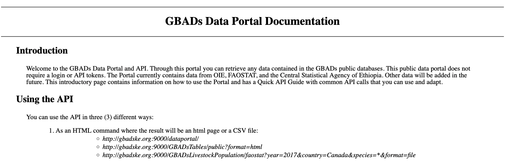
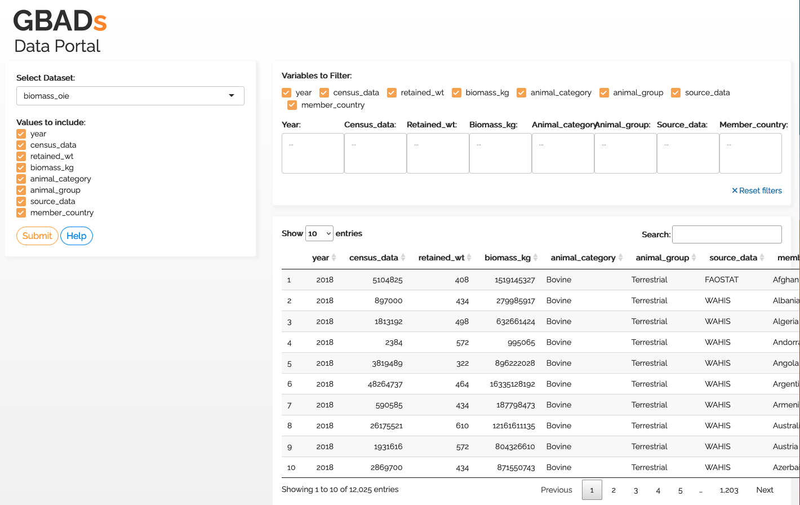

# Acceso a datos en el motor de conocimiento

## Objetivos:

* Comprender cómo acceder a diferentes tipos de datos en Knowledge Engine
* Comprender cómo buscar datos almacenados en Knowledge Engine

Para obtener información sobre qué hacer cuando identifica nuevos conjuntos de datos de interés para su uso en el programa GBAD, visite la sección Colaborador de datos del Manual de gobernanza de datos, que describe lo siguiente:

* Comprender las funciones y responsabilidades de las personas que han identificado un nuevo conjunto de datos para el uso del programa GBAD y cómo almacenar estos datos en Knowledge Engine.
* Comprender cómo la informática almacena datos de modelos en Knowledge Engine

---

Las formas de acceder a los datos consideran la capacidad de búsqueda, accesibilidad, interoperabilidad y reutilización de los datos tanto para **humanos** como para **máquinas**.

---


## Tipos de datos en Knowledge Engine

La guía del usuario de datos proporciona a los colaboradores de GBAD una descripción general de cómo acceder a los datos en el motor de conocimiento. Tenemos 3 tipos principales de datos:

1. Datos de entrada (o datos sin procesar)
2. Datos de salida de modelos
3. Conjuntos de datos intermedios

Cada tipo de datos y sus subconjuntos tienen un formato único y requieren requisitos de almacenamiento específicos para garantizar que los datos puedan ser encontrados, accesibles, interoperables y reutilizables (FAIR); todos los datos deben documentarse con metadatos para garantizar que sean JUSTOS.

### Datos de entrada

Los datos de entrada o sin procesar pueden presentarse en dos formas en el programa GBADs:

* Conjuntos de datos de fuentes como la Base de datos estadísticos de la Organización de las Naciones Unidas para la Alimentación y la Agricultura (FAOSTAT), la Organización Mundial de Sanidad Animal (WOAH), agencias nacionales de estadística, etc.
*Parámetros obtenidos de metanálisis de revisiones sistemáticas.
* Conjuntos de datos producidos a partir de ejercicios de obtención de expertos.

Estos datos son las _entradas_ a los modelos y cálculos que producen los temas de GBAD. Los datos de entrada pueden presentarse en diferentes formas, utilizar diferentes terminologías y estándares para nombrar países, especies u otras clasificaciones y, por lo tanto, pueden tener varias interpretaciones del significado.

Todos los temas y modeladores deben usar los mismos datos de entrada que se han limpiado solo una vez para garantizar que todos usemos las mismas entradas para los modelos. Esto garantiza la reproducibilidad y precisión de los datos en todo el programa.

### Datos de salida de modelos

Cuando se producen modelos o estimaciones, producen parámetros y conjuntos de datos que pueden usarse en modelos o estimaciones posteriores. Por lo tanto, los datos de salida de los modelos y estimaciones deben almacenarse en Knowledge Engine junto con los metadatos para garantizar que todos los usuarios puedan comprender cómo se completaron y produjeron los datos, incluido el código del modelo y los conjuntos de datos que se utilizaron para completar estos datos.

### Conjuntos de datos intermedios

Los conjuntos de datos intermedios pueden ser datos que se produjeron a través de una etapa de modelación o imputación pero que no se consideran un producto final. Sin embargo, los datos intermedios pueden usarse para otros procesos de modelado y pueden ser importantes para garantizar que los procesos de datos sean reproducibles.

## Acceso a datos en Knowledge Engine

Hay dos formas principales de acceder a los datos en Knowledge Engine:

1. A través de la interfaz de programación de aplicaciones (API)
2. Descarga directa a través de una URL desde un Bucket de Amazon S3

### API

---

**¿Qué es una API?**

API significa Interfaz de programación de aplicaciones. Es una forma de máquina a máquina de solicitar datos a un servidor, hacer que el servidor recupere e interprete los datos y los devuelva a su máquina. Las API están en todas partes; permiten que las aplicaciones "hablen" entre sí. Por ejemplo, cuando consulta el tiempo en una aplicación meteorológica, la aplicación utiliza una API para capturar los datos y presentarlos de una manera utilizable e interpretable en su teléfono. Las API proporcionan los datos más actualizados sin tener que almacenar datos en su propia máquina.

Para obtener más información sobre las API y cómo usarlas, visite el [Tutorial de API de GBAD] (https://gbadskedoc.org/docs/GBADsAPITutorial).

---

Los datos de entrada y salida se almacenan en tablas de [Amazon RDS](https://aws.amazon.com/rds/). La funcionalidad actual de la API incluye:

* Proporciona acceso a los datos contenidos en las bases de datos públicas.
* Proporciona una lista de todas las tablas contenidas en las bases de datos públicas.
* Para una tabla determinada, proporciona nombres de todos los campos y tipos de datos de esos campos.

Si bien puede haber una curva de aprendizaje para los usuarios humanos de la API, las API son importantes para proporcionar acceso a los datos de máquina a máquina (garantizando la interoperabilidad (intercambio de información) entre sistemas).

La documentación sobre cómo crear llamadas API está disponible en la [Página de documentación del portal de datos de GBAD] (http://gbadske.org/api/dataportal/).



Para mejorar la facilidad de uso para los usuarios humanos, [Kurtis Sobkowich](https://www.linkedin.com/in/kurtis-sobkowich/?originalSubdomain=ca) creó un panel para ver y descargar datos de la API de GBAD. La URL se vinculará en el Manual cuando el panel se publique en el servidor de GBAD. Por ahora, el panel está disponible en el servidor R shiny de Kurtis: (Interfaz de usuario API de GBADs)[https://kurtissobkowich.shinyapps.io/GBADs_API_UI/]. Espere retrasos: el panel será lento hasta que se entregue en los servidores de GBAD.



También hemos desarrollado un tutorial para usar la API de GBADs en R: [Acceder a la API de GBADs en R](https://gbadskedoc.org/docs/GBADsAPITutorial)

### Cubos S3

---

**¿Qué es un depósito de Amazon S3?**

Un [cubo de Amazon Simple Storage Service (S3)](https://docs.aws.amazon.com/AmazonS3/latest/userguide/Welcome.html) es un servicio de almacenamiento de objetos en la nube que le permite almacenar datos y otros objetos digitales. en las nubes.

---

Los datos de la API también están disponibles a través de depósitos de Amazon S3. Utilizando la URL de S3, los usuarios pueden descargar versiones csv de los datos. Además, almacenaremos archivos utilizados por GBAD que no se pueden almacenar en tablas RDS, como archivos de forma, imágenes, archivos de datos intermedios producidos por modelos, datos de metanálisis y cualquier otro dato que no se pueda estructurar en una tabla RD.

La URL de S3 se utilizará como identificador único de los datos y estará disponible en los metadatos de un conjunto de datos. La URL de S3 se podrá descubrir a través de la API de metadatos de GBAD y, eventualmente, a través de la interfaz de usuario del catálogo de datos (próximamente).

Archivos CSA S3 de Etiopía:

| Especies | Enlace S3 a instrucciones |
| ------- | ----------------------- |
| Camellos | https://gbads-eth.s3.ca-central-1.amazonaws.com/CSA/camels-region-instructions.pdf |
| Ganado | https://gbads-eth.s3.ca-central-1.amazonaws.com/CSA/cattle-region-instructions.pdf |
| Burros| https://gbads-eth.s3.ca-central-1.amazonaws.com/CSA/donkeys-region-instructions.pdf |
| Cabras | https://gbads-eth.s3.ca-central-1.amazonaws.com/CSA/goats-region-instructions.pdf |
| Caballos | https://gbads-eth.s3.ca-central-1.amazonaws.com/CSA/horses-region-instructions.pdf |
| Mulas | https://gbads-eth.s3.ca-central-1.amazonaws.com/CSA/mules-region-instructions.pdf |
| Aves de corral | https://gbads-eth.s3.ca-central-1.amazonaws.com/CSA/poultry-region-instructions.pdf |
| Ovejas | https://gbads-eth.s3.ca-central-1.amazonaws.com/CSA/sheep-region-instructions.pdf |

### Interfaz del portal de datos GBAD

## Búsqueda de datos en Knowledge Engine

Para utilizar los datos en Knowledge Engine, debe poder encontrarlos. La funcionalidad de búsqueda de datos se crea mediante una canalización de metadatos.

Cada tipo de datos tiene metadatos únicos que lo describen. Para obtener más información sobre los metadatos, visite la sección [Metadatos](https://gbadskedoc.org/docs/Data-Governance-Handbook-for-GBADs/metadata) del Manual.

**La API de metadatos se publicará pronto con información sobre cómo descubrir fuentes de datos almacenadas en GBADs KE basándose en información descriptiva que describe los datos**


<!-- El [portal de datos GBADs](http://gbadske.org:8050/dash/page-1/) es un prototipo de panel que permite a los usuarios acceder a conjuntos de datos de [FAOSTAT](http://www.fao .org/faostat/en/) y [OIE WAHIS](https://wahis.oie.int/). El prototipo le permite seleccionar datos de interés, visualizarlos en gráficos de líneas de barras, descargar los datos en formato `.csv` y `.json` y ver la llamada a la Interfaz de programación de aplicaciones (API). -->

<!-- ```{margen}
**¿Qué es `.json`?**

[JSON](https://en.wikipedia.org/wiki/JSON) significa notación de objetos JavaScript. JSON es un formato de archivo que almacena datos en un formato estructurado estándar, lo que permite que los datos sean legibles tanto por humanos como por máquinas. Los datos JSON se pueden leer en todos los lenguajes de programación y se pueden analizar en "Excel". Los datos JSON son legibles y más fáciles de analizar que otros formatos de archivo como [XML](https://en.wikipedia.org/wiki/XML).

```

````{margen}
```{admonición} ¡Queremos saber de usted!
:clase: consejo

Tenga en cuenta que esta página se actualizará a medida que sigamos mejorando nuestro portal de datos y obtengamos acceso a más fuentes de datos. ¡Agradecemos sus comentarios sobre lo que le gusta del sistema, lo que le gustaría ver y cualquier cosa que crea que podría ser más clara!
```
```` -->

<!-- ```{admonition} Objetivos de aprendizaje
* Los lectores deben comprender qué es una API, cómo funciona y por qué GBAD utiliza API.
* Los lectores deben comprender cómo utilizar la API de GBAD para obtener datos de FAOSTAT y OIE WAHIS.
* Los lectores deben comprender cómo utilizar la API de GBAD para leer datos en sus programas `R` y `python`.
``` -->

<!-- ## Comenzando con nuestra API -->

<!-- ### ¿Qué es una API?

Una interfaz de programación de aplicaciones (API) es una forma de máquina a máquina de solicitar datos a un servidor, hacer que el servidor recupere e interprete los datos y los devuelva a su máquina. Las API están en todas partes; permiten que las aplicaciones "hablen" entre sí. Por ejemplo, cuando consulta el tiempo en una aplicación meteorológica, la aplicación utiliza una API para capturar los datos y presentarlos de una manera utilizable e interpretable en su teléfono. Las API proporcionan los datos más actualizados sin tener que almacenar datos en su propia máquina.

Para las necesidades de datos de GBAD, las API funcionan así:
1. Usted/su programa solicita datos a través de la llamada API
2. El servidor web busca en su base de datos interna los datos que usted solicitó.
3. La base de datos le proporciona al servidor los datos que usted solicitó.
4. Los datos se devuelven a usted/a su programa.

### Su flujo de trabajo y API

Para explicar el concepto de API con más profundidad, analizaremos el flujo de trabajo común para acceder a datos para modelado y dónde entran en juego las API.

**Método de acumulación de datos manual**

Si no está utilizando API en su flujo de trabajo actual, el acceso a los datos probablemente consista en navegar a un portal o fuente de datos, buscar en el catálogo de datos o buscar un conjunto de datos de su interés y luego descargarlos. Cada vez que se actualizan los datos, debe repetir el proceso, buscar los datos, descargarlos nuevamente, importar el archivo a su modelo y volver a ejecutar con los números actualizados. Si bien este flujo de trabajo funciona, el uso de API puede eliminar el trabajo manual de ir al sitio web y obtener los datos cada vez que los necesita.

Cuando interactúa con el sitio web para obtener los datos que desea, es probable que esté interactuando indirectamente con una API, que funciona en el backend para obtener los datos que ha seleccionado y presentarlos nuevamente en la página web. Sin embargo, puede utilizar una **llamada API** para solicitar datos del servidor donde residen los datos de interés {numref}`APIcall`.

```{margen}
Una **llamada API** es la forma en que le solicita datos a un servidor.
```

**Uso de API para obtener datos**

En lugar de descargar datos manualmente desde un sitio web cada vez, puede incorporar llamadas API en su flujo de trabajo para solicitar los datos más actualizados de la fuente. Esto le permite volver a ejecutar el código sin tener que cambiarlo.

```{figura} /images/API.png
:nombre: llamada API

Desglose simple de cómo funciona una API.
``` -->


<!--Si nunca antes ha utilizado una interfaz de programación de aplicaciones (API), ¡no entre en pánico! Estás en el lugar correcto. Antes de profundizar en cómo usar nuestra API, explicaremos por qué creemos que las personas deberían adoptar el uso de API y qué es una API.

Es posible que haya oído hablar de una API antes y haya pensado: ¿qué es una API? A menudo, cuando se busca "API" en Google, uno se ve inundado de jerga técnica y palabras de moda, o información diseñada para ingenieros de software y departamentos técnicos. Sin embargo, las API son extremadamente valiosas para cualquiera que acceda activamente a un sitio web y descargue datos de él. El uso de una API le permite hacer que su computadora se comunique con un servidor web y solicite los datos, sin tener que ir a ese sitio web y descargar estos datos usted mismo. Por ejemplo, ahora mismo podría dirigirse al portal de datos del Banco Mundial navegando al sitio web, revisando el catálogo de datos o buscando el conjunto de datos de su interés y luego descargándolos. Ciertamente, este método manual es una forma válida de interactuar con un servidor web y permitirle obtener los datos que desea. Pero en realidad no es necesario interactuar con un sitio web de esta forma manual para obtener los datos que desea. Las API le permiten llamar al sitio web y solicitar los datos que desea sin tener que navegar por un sitio web (o incluso abrir su navegador web). Y, como aprenderá, ¡no es necesario tener una amplia experiencia en programación para utilizar una API! --->

<!--Las llamadas a la API se realizan utilizando el identificador de recursos único (URI) de la API. En pocas palabras, un URI es algo que distingue claramente a la API de otras API. Puedes pensar en un URI como cualquier cosa que identifique algo entre todas las demás cosas. Por ejemplo, su número de seguro social es su URI que permite al gobierno identificarlo entre otros ciudadanos. Del mismo modo, es posible que notes que nadie más tiene la misma dirección de correo electrónico que tú. ¡Una dirección de correo electrónico también es un URI! -->

<!--
Una vez que tenga esta 'llamada API', simplemente puede ingresar el programa de su elección y automatizar sus flujos de trabajo y tener acceso a los datos sin tener que buscar en catálogos de datos cada vez. Las API se basan en protocolos HTTP, lo que proporciona otra ventaja: puede utilizar las API con prácticamente cualquier lenguaje de programación, incluidos R y Python, que son los más populares entre nuestros usuarios actuales. Esto significa que en lugar de cargar archivos de datos en su programa R o Python cada vez, simplemente puede acceder a la API directamente en su programa. Un beneficio adicional es que esto le permite volver a ejecutar sus programas sin tener que descargar datos de sus fuentes cada vez que esa fuente se actualiza o modifica.

Algunas fuentes de datos que utiliza GBAD, como FAOSTAT y el Banco Mundial, tienen API que se pueden utilizar para obtener datos. Sin embargo, GBADs se encarga de la gestión de API mediante el desarrollo de una API que puede solicitar datos de otras API ({numref}`GBADsAPI`).

```{figura} /images/GBADsAPI.png
:nombre: GBADsAPI

Descripción general de la infraestructura API de GBAD. La API de GBAD puede comunicarse con otras API abiertas para acceder a datos de otros almacenes de datos, como FAOSTAT. La API de GBAD también permite solicitar datos del almacén de datos de GBAD. Los usuarios pueden acceder a datos de varias fuentes a través de una llamada API a la API de GBAD.
```

````{margen}
```{admonition} Datos de acceso especial
:clase: consejo

_Tenga en cuenta que algunos datos no están disponibles públicamente y, por lo tanto, no están disponibles para todos los usuarios_. Consulte [el capítulo sobre Licencias de datos, privacidad y seguridad] (http://www.gbadske.org/Documentation/DataGovernanceHandbook/dataOwnership.html) para obtener más información sobre cómo GBAD maneja datos confidenciales y sensibles.
```
````


### Usando la API de GBAD

Puede consultar nuestra documentación API más extensa [FIXME aquí]. Sin embargo, esta sección le mostrará los conceptos básicos del uso de nuestra API para recuperar algunos datos.

Proporcionaremos dos ejemplos de llamadas API a la API de GBAD. Uno en Python y otro en R. En ambos ejemplos usaremos la misma llamada API que le brindará el precio de las acciones de pollos en Etiopía de 2005 y 2018 según la FAO. Nuestra llamada API para este tipo de datos es: [http://35.183.203.15:8000/gbads/LiveAnimals/?year_start=2005&year_end=2018&element=Stocks&item=Chickens](http://35.183.203.15:8000/gbads/LiveAnimals /?year_start=2005&year_end=2018&element=Stocks&item=Pollos)

```{margen}
Notará que si realiza la llamada API directamente en su navegador, accederá a una página con los datos en formato JSON. También notarás que la llamada API especifica la categoría (LiveAnimals), el año de inicio y fin, el elemento, que son los precios de las acciones y el artículo, Pollos. Actualmente, nuestro portal solo admite la recuperación de datos de Etiopía, ya que ese es el objetivo de nuestro estudio piloto.
```

```{nota}
Todavía estamos desarrollando nuestra API de metadatos.
```

En nuestro caso de uso de Python, necesitará descargar tres bibliotecas: `json`, `requests` y `pandas`.

```{código-celda} ipython3
importar json
solicitudes de importación
importar pandas como pd
importar seaborn como sns
importar matplotlib.pyplot como plt

# Crear llamada API
apiCall = "http://15.223.72.239:8000/gbads/LiveAnimals/?year_start=2005&year_end=2018&element=Stocks&item=Pollos"

respuesta = solicitudes.get(apiCall).json()

# Imprime la respuesta para que podamos ver lo que obtuvimos.
imprimir (respuesta)
```

En algunos casos, es posible que desee convertir su respuesta a un marco de datos "pandas", visualizar el resultado o guardarlo en un archivo csv. A continuación, le demostraremos cómo puede lograr cada uno de los siguientes:

```{código-celda} ipython3
# Crear marco de datos de pandas a partir de la respuesta de la API
respuesta = pd.DataFrame(respuesta)

# ¿Cuál es nuestro resultado? Imprima las primeras 10 filas del marco de datos.
imprimir(respuesta.cabeza(10))
```

Antes de continuar y graficar estos datos, podemos usar "pandas" para obtener una descripción general de los datos que obtuvimos de la llamada a la API.

```{código-celda} ipython3
# ¿Qué columnas tenemos?
imprimir (respuesta.columnas)
```

También podemos ver resúmenes de las columnas:

```{código-celda} ipython3
respuesta.describe()
```

```{código-celda} ipython3
# ¡Grafica el tiempo!
respuesta.plot.scatter(x='Año',
y='Valor',
c='Azul oscuro')
```
Y para divertirnos, visualicemos una relación lineal a través de la función de regresión lineal de "seaborn". La función proporciona una línea de regresión en un gráfico con un intervalo de confianza del 95%.

```{código-celda} ipython3

ax = sns.regplot(x="Año", y="Valor", datos=respuesta)

# Establecer etiquetas de eje
ax.set(xlabel='Año', ylabel='Número de animales vivos (1000 cabezas)')

# Añade un titulo
plt.title("Número de pollos vivos en Etiopía")

# Mostrar el resultado
plt.mostrar(ax)

```

Como puede ver, con muy poco trabajo recopilamos los datos de la API, los convertimos en un marco de datos "pandas" y trazamos una regresión.

También podríamos trazar los datos y visualizar qué puntos corresponden a datos oficiales y cuáles fueron imputados:

```{código-celda} python3
# Diferentes colores para las descripciones de las banderas.
sns.scatterplot(x="Año", y="Valor", tono="Descripción de la bandera", datos=respuesta)

# Establecer etiquetas de eje
ax.set(xlabel='Año', ylabel='Número de animales vivos (1000 cabezas)')

# Añade un titulo
plt.title("Número de pollos vivos en Etiopía")

# Mostrar el resultado
plt.mostrar(ax)

```


Si está interesado en simplemente recopilar los datos de la API y guardarlos como csv, puede utilizar el siguiente código para hacerlo.

```
importar json
solicitudes de importación
importar pandas como pd

# Crear llamada API
apiCall = "http://15.223.72.239:8000/gbads/LiveAnimals/?year_start=2005&year_end=2018&element=Stocks&item=Pollos"

respuesta = solicitudes.get(apiCall).json()

# Codificar/decodificar el marco de datos para obtenerlo en formato csv
respuesta = respuesta.to_json(orient='dividir')
respuesta = pd.read_json(respuesta,orient='dividir')

# Nombre del archivo de salida. Reemplace esto con la ruta donde desea almacenar el archivo y el nombre del archivo.
archivo de salida = 'ruta/al/archivo de salida/nombre de archivo de salida.csv'

# Guardar en un archivo usando pandas
respuesta.to_csv(archivo de salida, índice=Falso)
```

Aquí está nuestra implementación de R:

Deberá asegurarse de tener descargados los paquetes R `httr` y `jsonlite`.

```
# Descomente la línea a continuación si aún no tiene las bibliotecas
# instalar.paquetes(c("httr", "jsonlite"))

# Cargar en bibliotecas
biblioteca(httr)
biblioteca (jsonlite)

# Crear llamada API
apiCall = "http://15.223.72.239:8000/gbads/LiveAnimals/?year_start=2005&year_end=2018&element=Stocks&item=Pollos"

# Enviar petición
respuesta = OBTENER (llamada API)

# Ver que nos da la respuesta
respuesta

# Crear un marco de datos a partir de la respuesta de la API
datos = fromJSON(rawToChar(respuesta$contenido))

# Verifique para asegurarse de que funcionó
clase (datos)

# Vea cómo se ven las primeras 5 filas de los datos
cabeza (datos)
``` -->

<!-- ## Creando un perfil de usuario

La guía anterior le permite acceder a la API, que permite el acceso a datos abiertos. En el futuro, anticipamos fuentes de datos privadas a las que solo tendrá acceso si se le otorgan permisos. Nuestro sistema admitirá la capacidad de crear un inicio de sesión de usuario verificado, que le dará acceso a las fuentes privadas a las que tiene acceso a través de un portal personalizado y una clave API. -->

