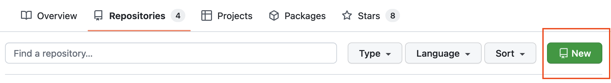
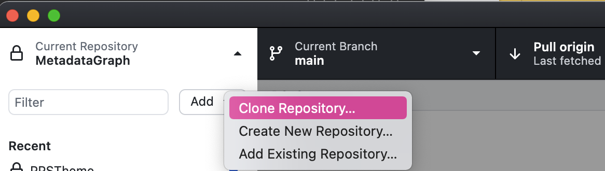
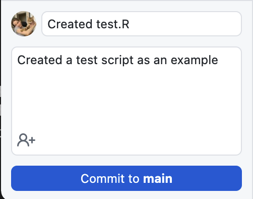
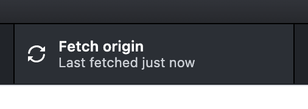

# Lehrmaterialien und Best Practices

## Best Practices für die Codierung

GBADs-Mitglieder verwenden am häufigsten R und Python zum Codieren, Bereinigen und Organisieren von Daten sowie zum Erstellen ihrer Modelle. Best Practices für Codierungskonventionen sorgen dafür, dass Code lesbar und wiederverwendbar ist. Dies sind die Best Practices, die GBADs Informatiker und Modellierer vorschlagen, um sicherzustellen, dass wir Code verstehen und verwenden können.


<!---

James und Gemma – dieser Bereich ist in der Markdown-Datei auskommentiert. Wenn Sie im Text „Ermahnung“ sehen, bedeutet das nur, dass ein kleines Nicht-Kästchen angezeigt wird!

· Kommentar mit dem Namen des Erstellers, Datum (im ISO 8601-Format? Z. B. 20210729), was das Skript enthält (z. B. Hauptkomponentenanalyse)?

· Im R-Skript geladene Bibliotheken

· Arbeitsverzeichnis festlegen?

· Die Daten sollten am Ende des Bereinigungsprozesses „aufgeräumt“ sein (siehe Data Governance Handbook oder R für Data Science).

· Organisieren Sie Daten von links nach rechts mit kategorialen Variablen und dann kontinuierlichen Variablen. Variablen sollten gegebenenfalls in Gruppen zusammengefasst werden (z. B. Besatzdichte bei der Ausdünnung, Gewicht bei der Ausdünnung, Datum der Ausdünnung usw.)?

· Entfernen Sie irrelevante Spalten aus dem Datensatz (z. B. Längen- und Breitengrad).

· Code gut dokumentiert

· Verwenden Sie die Standardkonvention für Dateinamen (z. B. 20210617_FAO_ProductionPrices_Poultry_Ethiopia_metadata.csv, NICHT FAO Production Prices – heruntergeladen von Kassy am 25. April.csv)

· Snake zum Benennen von Objekten in R (z. B. Majority_Parent_Flock_Old)

· Objekte sollten einen aussagekräftigen Namen haben


--->

### Best Practices für die R-Codierung

#### 1. Namenskonventionen

**Dateibenennung**

Für den Dateinamen und alle in Ihrem Code definierten Variablen und Funktionen werden Standardbenennungskonventionen verwendet.

Dateinamen sollten dem Format „dateOfCreation_meaningfulCodeName.R“ folgen.

Wenn mein Code beispielsweise Viehbestandsdaten bereinigt und neu formatiert, könnte ich mein Skript „20210703_faoLivestockProductionDataCleaning.R“ nennen

---

Weitere Informationen zu unserer Standardkonvention für Datum und Uhrzeit finden Sie in [Standardkonvention für Datum und Uhrzeit](https://gbadskedoc.org/docs/Data-Governance-Handbook-for-GBADs/educationalMaterials#standard-date-and-time-convention )

---

**Variablenbenennung**

Verwenden Sie `snake_case` zum Benennen von Variablen und Funktionen in Ihrem Code. Die Verwendung einer standardisierten Namenskonvention verbessert die Lesbarkeit und Interpretierbarkeit des Codes.

Verwenden Sie beim Benennen von Variablen und Funktionen aussagekräftige Namen. Der Name des Objekts sollte seinen Nutzen oder seine Eigenschaften widerspiegeln. Wenn Sie beispielsweise einen Datenrahmen für die Tierproduktion einlesen:

```
livestock_df <- read_csv('path/to/my/important/file.csv')
```

```{admonition} Seien Sie vorsichtig, wenn Sie das Arbeitsverzeichnis festlegen
Denken Sie daran, dass, wenn Sie `setwd()` zum Festlegen des Arbeitsverzeichnisses für Ihr Projekt oder Skript verwenden, das Arbeitsverzeichnis für Ihren Computer unterschiedlich ist und die Reproduzierbarkeit Ihres Codes beeinträchtigen kann.
```

#### 2. Organisieren Sie das Format Ihres Codes

Beginnen Sie Ihr Skript mit dem Namen des Erstellers, dem Datum der letzten Bearbeitung des Skripts (in ISO 8601) und einer kurzen Beschreibung des Zwecks des Skripts.

```
##################################
# Schöpfer: Kassy Raymond
# E-Mail: kraymond@uoguelph.ca
# Datum der letzten Bearbeitung: 20210803

# Dieses Programm enthält Code, der eine Hauptkomponentenanalyse (PCA) durchführt.
# zu Tierproduktionsdaten aus Äthiopien. Die Daten, die dabei verwendet wurden
# Programm stammt aus dem FAOSTAT-Produktionsdatensatz und wurde heruntergeladen
# 03.08.2021. Die Ausgabedaten dieses Skripts werden in einem Modell verwendet
# berechnet Biomasse.

##################################
```

Dokumentieren Sie Ihren Code mit Kommentaren, damit der Leser Ihres Codes (oder Sie in Zukunft) jeden Schritt verfolgen kann, den Sie in Ihrem Skript ausgeführt haben.

Laden Sie alle Bibliotheken zu Beginn Ihres Programms. In R könnte das so aussehen:

```
## 0 – Alle Bibliotheken laden

Bibliothek(tidyverse)
Bibliothek(ggplot2)
Bibliothek(knitr)
Bibliothek(readr)
Bibliothek(forcats)
Bibliothek(dplyr)
```

Segmentieren Sie Ihren Code nach Möglichkeit in Abschnitte. Dies trägt zur Reproduzierbarkeit bei und macht den Code besser lesbar.

```
## 0 – Alle Bibliotheken laden

Bibliothek(tidyverse)
Bibliothek(ggplot2)
Bibliothek(knitr)
Bibliothek(readr)
Bibliothek(forcats)
Bibliothek(dplyr)

## 1 – Quelldateien

data_path <- 'Pfad/zu/meiner/wichtigen/Datei.csv'
livestock_df <- read_csv(data_path)

## 2 – Datenbereinigung

# Löschen Sie nicht benötigte Spalten

# Suchen Sie nach NAs

# Untersuchen Sie Daten und suchen Sie nach Ausreißern oder Fehlern in den Daten

## 3 – Modellieren

```

#### 3. Datenbereinigung

##### 3.1 Löschen Sie nicht benötigte Spalten frühzeitig in Ihrem Code

Wenn Sie eine Spalte in der weiteren Analyse nicht verwenden, löschen Sie sie in der Datenbereinigungs- und Untersuchungsphase Ihres Skripts. Dies verbessert die Interpretierbarkeit Ihres Codes und erhöht die Verarbeitungsgeschwindigkeit Ihres Programms.

##### 3.2 Merken Sie sich die Datenherkunft

Es ist wichtig, dass die von Modellen erstellten Schätzungen, Modelle, Grafiken und Ausgabedatensätze reproduziert werden können. Daher ist es wichtig, den verwendeten Originaldatensatz einzubeziehen bzw. bei Verwendung von APIs die Möglichkeit zur Rückverfolgung zum Originaldatensatz zu ermöglichen.

Wenn Sie Ihre Daten heruntergeladen haben, stellen Sie sicher, dass Sie eine Kopie des Originaldatensatzes speichern und diese in Ihrem Workflow **nicht überschreiben**.

Wenn zum Abrufen der Daten ein API-Aufruf durchgeführt wurde, stellen Sie sicher, dass der Datumsstempel dieses Aufrufs im Namen Ihres erstellten Ausgabedatensatzes, Ihrer Modelle oder Grafiken angegeben ist. Sie können sich auch erneut dafür entscheiden, eine Kopie des Originaldatensatzes zu speichern.

##### 3.3 Stellen Sie sicher, dass die Daten am Ende der Datenbereinigungsphase in einem „ordentlichen“ Format vorliegen

Siehe auch Organisieren von Tabellenkalkulationen in diesen Lehrmaterialien und [R für Data Science](https://r4ds.had.co.nz/) von Hadley Wickham.

##### 3.4 Daten organisieren

Organisieren Sie Daten von links nach rechts mit kategorialen Variablen und dann kontinuierlichen Variablen. Variablen sollten gegebenenfalls gruppiert werden (z. B. Besatzdichte bei der Ausdünnung, Gewicht bei der Ausdünnung, Datum der Ausdünnung usw.).

#### 4. Weitere Empfehlungen

- Probieren Sie RStudio für Ihre IDE aus!


## Daten in Tabellenkalkulationen organisieren

> "Müll rein, Müll raus"

Wenn Sie dies lesen, verbringen Sie wahrscheinlich viel Zeit damit, sich mit Daten zu befassen. Sie könnten es sammeln, bereinigen, modellieren, teilen, versuchen, es zu interpretieren und dann das Ganze noch einmal machen. Wenn Sie Daten von einem Kollegen erhalten, versuchen Sie möglicherweise, diese erneut zu bereinigen (auch wenn sie bereits bereinigt wurden), versuchen, sie zu interpretieren, und müssen möglicherweise sogar mehrere E-Mails schreiben, um die Daten zu interpretieren.

**In diesem Teil des Handbuchs erklären wir Ihnen, wie Sie Ihre Daten in Tabellenkalkulationen besser organisieren können, um qualitativ hochwertigere Daten zu erstellen, die zu qualitativ hochwertigeren Modellen führen. Wir definieren auch einige Standardpraktiken für die Eingabe von Daten bestimmter Typen, einschließlich Datumsangaben und langer Zahlen.**

### Tabellenkalkulationen und Datensätze

Tabellenkalkulationen, wie sie beispielsweise in Microsoft Excel und Google Sheets erstellt werden, werden häufig zum Speichern, Eingeben, Teilen und Bearbeiten von Forschungsdaten verwendet. Tabellenkalkulationen werden häufig zur Kommunikation von Forschungsergebnissen weitergegeben und als Eingabedaten für Modelle oder statistische Analysen verwendet. Obwohl Tabellenkalkulationen ein integraler Bestandteil des Datenlebenszyklus sind, müssen sie ordnungsgemäß strukturiert sein, um sicherzustellen, dass keine Fehler gemacht werden, die dazu führen, dass Daten nicht wiederverwendet oder interpretiert werden können. Kleine Fehler in Tabellenkalkulationen können dazu führen, dass Daten schwer zu verstehen, schwer zu analysieren und zeitaufwändig zu bereinigen sind.

---
**NOTIZ**

Bitte wenden Sie sich an das GBADs-Informatikteam, wenn Sie ein GBADs-Mitglied sind und über viele Tabellenkalkulationen mit „unordentlichen“ Daten verfügen! Wir können Sie beraten und darüber nachdenken, wie Sie ein Programm erstellen können, das Ihre Daten verarbeitet und in ein ordentliches Format umwandelt!

---

Die richtige Strukturierung von Daten in Tabellenkalkulationen führt dazu, dass Daten wiederverwendbar und interoperabel (FAIR) sind, was zu einer höheren Datenqualität und letztendlich zu einer besseren Forschung führt. Durch die Einrichtung von Tabellenkalkulationen zur Aufnahme in Statistiksoftware oder Bibliotheken von Anfang an können wir Verwirrung minimieren und unsere Arbeitsabläufe vereinfachen.

---

Lernziele
* Leser sollten verstehen, wie ein Datensatz in einer Tabellenkalkulation so strukturiert wird, dass FAIR-Datenprinzipien unterstützt werden
* Leser sollten verstehen, wie sie ihren Datensatz strukturieren, um die Semantik (die zugrunde liegende Bedeutung) der Daten zu bewahren
* Leser sollten verstehen, wie Datumsangaben und lange Zahlen in Tabellenkalkulationen strukturiert werden und warum es wichtig ist, dass diese Daten maschinenlesbar sind
* Leser sollten häufige Fehler verstehen, die zu unordentlichen Datensätzen führen, und wissen, wie sie diese vermeiden können

---

### Datenstruktur


> „Aufgeräumte Datensätze sind alle gleich, aber jeder unordentliche Datensatz ist auf seine eigene Art unordentlich.“

> -- [Hadley Wickham](http://hadley.nz/)


Im Allgemeinen besteht ein aufgeräumter oder sauberer Datensatz aus Folgendem [^1]:


**Spalten (Variablen)**

* Spalten sind eine Gruppe vertikal ausgerichteter Zellen. In Datensätzen sind Spalten Variablen, wobei jede Zelle eine Information über ein bestimmtes Attribut enthält.

**Zeilen (Beobachtungen)**

* Zeilen sind eine Gruppe von Zellen, die horizontal ausgerichtet sind, wobei jede Zeile eine Beobachtung darstellt.

**Zellen (Werte)**

* In Datensätzen ist jede Zeile eine Beobachtung und jede Zelle in dieser Zeile enthält den Wert der Spalte, in die sie fällt.


Regeln, die für einen aufgeräumten Datensatz sorgen: Spalten sind Variablen, Beobachtungen sind Zeilen und Werte sind Zellen. Bild und Bildunterschrift von [^1].

Die Einhaltung eines aufgeräumten Datenformats ermöglicht die Wiederverwendbarkeit von Daten, gewährleistet Konsistenz (was die Datenqualität verbessert) und hilft, die zugrunde liegende Bedeutung (Semantik) jedes einzelnen Werts in der Tabelle zu verstehen. Wenn wir Spalten als Variablen und Zeilen als Beobachtungen haben, können wir anhand seiner Beziehung zu den Variablen und Beobachtungen erkennen, was ein Wert bedeutet.

FAIR-Daten sind aufgeräumte Daten – aufgeräumte Daten sind von Natur aus wiederverwendbar und interoperabel. Aufgeräumte Daten sind leichter auffindbar, da die Header klar definiert sind, was die Erstellung von Metadaten erleichtert. Grundsätzlich können wir aus aufgeräumten Daten mehr Informationen gewinnen.

### Tabellenkalkulationen speichern

Datensätze in Tabellenkalkulationen können als Excel-Datei oder im Format „.csv“ (durch Kommas getrennter Wert) oder „.txt“ gespeichert werden. Die beiden letztgenannten werden bevorzugt, da sie einfacher in Programmierbibliotheken in R und Python einzulesen sind.

### Standardkonvention für Datum und Uhrzeit

Ohne eine Standardkonvention können Datumsangaben sehr vieldeutig sein. Beispielsweise könnte 01/11 als Januar 2011, November 2001 oder 1. November interpretiert werden. Aus diesem Grund ist es wichtig, einen international anerkannten Datumsstandard zu verwenden, damit wir unsere Daten zuverlässig verstehen können.

GBADs verwenden den [ISO 8601](https://www.iso.org/iso-8601-date-and-time-format.html) Standard für Datumsangaben. ISO 8601 ist ein international anerkannter Standard, der den [Gregorianischen Kalender](https://en.wikipedia.org/wiki/Gregorian_calendar) verwendet.

Termine werden dargestellt als:
- JJJJ-MM-TT oder JJJJMMTT

Der ISO 8601-Standard verwendet das 24-Stunden-Format. Zeiten können daher eingegeben werden als:

- T[hh:mm:ss]

oder wenn Sekunden nicht anwendbar sind:

- T[hh:mm]

und wenn das Protokoll nicht anwendbar ist:

- T[hh]

Da es sich bei GBADs um eine globale Organisation handelt, ist es wichtig, bei der Eingabe der Zeit in Tabellenkalkulationen Zeitzonen anzugeben. Zeitzonen werden nach dem Datum angegeben, indem angegeben wird, wie weit die Zeitzone hinter oder vor der UTC liegt.

Zum Beispiel:
Samstag, 10. Juli 2021 um 13:48 Uhr EDT wird als 2021-07-10T13:48-4:00 geschrieben


---
**Verschiedene Kalender für verschiedene Länder**

Beachten Sie bei der Analyse von Datensätzen aus verschiedenen Ländern, dass nicht alle Teile der Welt den Gregorianischen Kalender verwenden.

Äthiopien verwendet beispielsweise den äthiopischen Kalender, der sich vom gregorianischen Kalender unterscheidet. Damit liegt Äthiopien sieben Jahre hinter dem in Europa und Nordamerika verwendeten Kalender. [Hier](https://melaku.ml/) ist ein Tool, mit dem Sie vom gregorianischen in den äthiopischen Kalender konvertieren können.

---

### Große Anzahl Konventionen

Je nach Land gibt es unterschiedliche Konventionen für große Zahlen.

Beispielsweise kann die Zahl 133333.450 auf verschiedene Arten dargestellt werden:

Im englischsprachigen Raum könnte die Zahl so aussehen:
- 133.333,450

In nicht englischsprachigen Ländern etwa so:
- 133.333.450

Also - die gleiche Zahl, aber auf drei verschiedene Arten dargestellt. Dies lässt viel Interpretationsspielraum, insbesondere da die Standardeinstellung beim Einlesen der meisten Dateien in statistische Programmiersprachen davon ausgeht, dass ein Komma eine neue Spalte angibt. Und da ein Großteil der Arbeit von GBADs auf Programmiersprachen wie R und Python beruht, ist es wirklich wichtig, unsere Zahlen so zu strukturieren, dass sie auch von Maschinen leicht eingelesen, interpretiert und gelesen werden können!

Um die Übersichtlichkeit zu wahren, sollten wir unsere großen Zahlen **ohne** Kommas strukturieren und Punkte reservieren, um eine Dezimalstelle anzugeben.


---
Wenn Sie ein Komma sehen, wo es Ihrer Meinung nach nicht stehen sollte ...

Wenn Ihnen die Formatierung großer Zahlen unklar ist, bitten Sie den Dateneigentümer um Klärung! Wenn der Dateneigentümer Teil des GBADs-Programms ist, schlagen Sie ihm sanft vor, die vom Programm verwendeten und festgelegten Standards zu verwenden (Sie können dieses Kapitel sogar mitschicken).

---

### Dateibenennungskonvention

Bei der Benennung von Dateien sollten Sie konsistent und beschreibend sein, Zeichen und Leerzeichen vermeiden und das Datum angeben (vorzugsweise unter Verwendung eines Standards wie [ISO 8601](https://www.iso.org/iso-8601-date-and-). time-format.html). Aus Gründen der Dateinamenskonvention werden wir die Bindestriche zwischen JJJJ-MM-TT weglassen.

**Beispiele für gute Dateinamenskonventionen:**

Beim Umgang mit von Organisationen heruntergeladenen Daten:
* JJJJMMTT_organization_topic_species_country
* 20210617_FAO_ProductionPrices_Poultry_Ethiopia.csv
* 20210617_WorldBank_LSMS_Ethiopia.csv

Dabei ist JJJJMMTT das Datum, an dem Sie die Datei heruntergeladen haben.

Wenn es sich um eine Metadatendatei handelt, sollten Sie die Datei mit „Metadaten“ und dem Dateinamen wie oben benennen, um zu wissen, welche Metadatendatei dem richtigen Datensatz entspricht. Zum Beispiel:

* 20210617_FAO_ProductionPrices_Poultry_Ethiopia_metadata.csv
* 20210617_WorldBank_LSMS_Ethiopia_metadata.csv

**Beispiele für schlecht benannte Dateien:**
* FAO-Produktionspreise – heruntergeladen von Kassy am 25. April.csv
* Äthiopische Produktionspreise von der FAO-Stat-Website.csv
* ETHPRODPRICES_GOODCOPY.csv


---
**Termine zuerst**

Wenn Sie in einer Datei das Datum an die erste Stelle setzen, können Sie Dateien in einem Verzeichnis oder Ordner ganz einfach nach auf- oder absteigendem Datum organisieren.

---

### Häufige Fehler

Formatierungen, Hervorhebungen und Fettdruck sollten vermieden werden. Hier erfahren Sie, warum die hübsche Erstellung von Tabellenkalkulationen im Datenanalyse-Lebenszyklus Kopfschmerzen bereitet:

#### 7 häufige Fehler, die Tabellenkalkulationen unübersichtlich machen

1. Mehrere Tabellen in einer Tabelle
2. Ungültige Nullwerte (eine Null bedeutet nicht Null)
3. Zellen werden zusammengeführt
4. Maßeinheiten sind in den Werten anstelle der Spaltennamen enthalten
5. Formatierung wird zur Darstellung von Informationen verwendet
6. Zellen enthalten mehr als eine Information
7. Das Standarddatumsformat wird nicht verwendet

***1. Mehrere Tabellen in einer Tabelle***

Das Vorhandensein mehrerer Tabellen in einer Tabellenkalkulation führt häufig zu einer unnötigen Datenbereinigung für die weitere Datenverarbeitung. Mehrere Tabellen in einer Tabelle führen zu Verwirrung, wenn wir die Tabelle teilen oder zu einem späteren Zeitpunkt darauf zurückkommen. Wenn es sich bei einer Zeile um eine Beobachtung handelt, widerspricht das Erstellen mehrerer Tabellen dieser Vorstellung, da die Qualität und die Fähigkeit zur Interpretation des Datensatzes beeinträchtigt werden.

Im folgenden Beispiel, das aus erfundenen Daten besteht, gibt es 4 Tabellen in einer einzigen Tabelle. In jeder Tabelle ist das „Element“ die Beobachtung und die Anzahl der lebenden Tiere in einem bestimmten Jahr wird gemessen. Aufgrund der Art und Weise, wie die Tabelle aufgebaut ist, ist es jedoch schwierig zu erkennen, ob beide oberen Tabellen mit Kanada in Zusammenhang stehen oder ob in der Tabelle rechts eine Überschrift fehlt.


Ein besserer Weg, die Daten einzurichten, wäre so:


Hier sehen wir, dass weiterhin alle Informationen bereitgestellt werden, jede Zeile jedoch eine Beobachtung für ein bestimmtes Land, einen bestimmten Artikel und ein bestimmtes Jahr darstellt. Zusätzlich zur Verbesserung der Interpretierbarkeit der Daten können diese Daten nun ohne umfangreiche Datenbereinigung in eine Statistiksoftware wie R eingegeben werden.

***2. Ungültige Nullwerte***

Fehlende oder Nullwerte sollten auf eine Standardart angegeben werden, die sich von einem quantitativen Wert von 0 unterscheidet. Auf diese Weise versteht der Datensatzleser, welche Daten fehlen oder unbekannt sind und welche einen Wert von 0 haben. Das Wichtigste bei der Erfassung fehlender Daten Werte sind Konsistenz; Wenn Sie sich entscheiden, „NA“ zur Kennzeichnung fehlender Werte zu verwenden, stellen Sie sicher, dass Sie später in der Tabelle nicht zu Kleinbuchstaben („na“) oder „Nicht anwendbar“ wechseln.

Je nach Statistiksoftware kann die Bedeutung von „NA“ variieren. Beispielsweise ist „NA“ in R ein reservierter Begriff für einen fehlenden Wert. Die Art und Weise, wie „NA“-Werte in Python dargestellt werden, variiert je nach verwendeter Bibliothek. In Pandas (einer beliebten Python-Bibliothek für Datenanalyse, -bereinigung und -wrangling) werden „NA“-Werte durch „NaN“ oder „None“ dargestellt. Solange wir jedoch bei der Eingabe und Analyse von Daten konsistent in der Art und Weise sind, wie wir „NA“-Werte darstellen, können wir je nach gewählter Statistik- oder Programmiersoftware schnell zwischen den Formaten wechseln.

***3. Zellen werden zusammengeführt***

Das Zusammenführen von Zellen widerspricht der Vorstellung, dass Zeilen Beobachtungen und jede Spalte eine Variable sind. Das Zusammenführen von Zellen verstößt nicht nur gegen diese Grundsätze, es macht auch das Sortieren von Spalten und Zeilen unmöglich, verursacht Fehler beim Einlesen von Daten in Statistiksoftware und birgt die Möglichkeit einer Fehlinterpretation von Daten oder eines Informationsverlusts. Wenn Sie beispielsweise zusammengeführte Zellen verwenden, um zwei Zeilen miteinander zu verknüpfen, führt dies zu Verwirrung, wenn Sie sich die Daten erneut ansehen. Oder wenn die zusammengeführte Formatierung verloren geht, besteht die Gefahr, dass eine gesamte Beobachtung oder Variablen in einer bestimmten Beobachtung verloren gehen.

***4. In den Werten sind anstelle der Spaltennamen Maßeinheiten enthalten***

Da jede Spalte eine Variable darstellt, sollten die Maßeinheiten in der gesamten Spalte konsistent sein. Daher sollten Sie gegebenenfalls die Maßeinheit in die Spaltenüberschrift aufnehmen.

***5. Formatierung wird zur Darstellung von Informationen verwendet***

Das Hervorheben von Zellen und das Fett- oder Kursivschreiben von Informationen sollten als Mittel zur Darstellung von Informationen in einem Datensatz vermieden werden. Das ist problematisch, denn wenn die Formatierung verloren geht, gehen wertvolle Informationen verloren. Wenn Sie die durch die Formatierung artikulierten Informationen in Ihr Modell oder Ihre Analyse einbeziehen möchten, müssen Sie das Blatt in Excel bereinigen, bevor Sie es in Ihrer Software lesen.

Wenn man beispielsweise Proben auf Krankheiten untersucht, könnte man durch Hervorhebung anzeigen, welche Proben positiv ausfielen. Wenn die Formatierung verloren geht oder jemand den Kontext der Bedeutung der Hervorhebung nicht kennt, gehen diese Informationen verloren.

***6. Zellen enthalten mehr als eine Information***

Wenn Zellen mehr als eine Information enthalten, schränkt dies die Analyse eines bereits vorhandenen Datensatzes ein und führt in der Regel zu einer stärkeren Datenbereinigung. Beispielsweise können Sie Rassentypen und -zahlen in Ihrem Datensatz angeben.

In diesem Fall möchten Sie die Rasse und die Anzahl in separaten Spalten wie dieser angeben:

| Rasse | Zählen | Bauernhof | DateCounted |
| :---: | :---: | :---: | :---: |
| Aberdeen Angus | 20 | Kanadische Rinderfarmen | 01.06.2021 |
| Abergele | 60 | Kanadische Rinderfarmen | 01.06.2021 |
| Limousin | 10| Kanadische Rinderfarmen | 01.06.2021 |

Anstatt sie in derselben Zelle zu melden, gehen Sie wie folgt vor:

| NumberOfBreed | Bauernhof | DateCounted |
| :---: | :---: | :---: |
| 20 Aberdeen Angus | Kanadische Rinderfarmen | 01.06.2021 |
| 60 Abergele | Kanadische Rinderfarmen | 01.06.2021 |
| 10 Limousine | Kanadische Rinderfarmen | 01.06.2021 |


***7. Standard-Datumsformat wird nicht verwendet***

Verwenden Sie bei der Eingabe von Datumsangaben einen Standard wie [ISO 8601](https://www.iso.org/iso-8601-date-and-time-format.html) (JJJJ-MM-TT). Dadurch können Sie nach Datum sortieren, die Interpretierbarkeit verbessern und bei Bedarf problemlos in andere Datumsformate konvertieren. Weitere Informationen darüber, wie GBADs mit der Eingabe von Datums- und Uhrzeitangaben umgehen, finden Sie im Abschnitt **Standardkonventionen für Datum und Uhrzeit** dieses Abschnitts.

Achten Sie außerdem bei der Verwendung von Datumsangaben darauf, die Bedeutung des Datums anzugeben. Eine Spaltenüberschrift mit der einfachen Überschrift „Datum“ liefert nicht viel Kontext. Bedeutet „Datum“ beispielsweise das Datum, an dem die Daten in die Tabelle eingegeben wurden? Das Datum, an dem eine Probe entnommen wurde? Das Datum, an dem eine Probe im Labor untersucht wurde? Stellen Sie sicher, dass andere Forscher (und Sie in Zukunft) wissen, wovon Sie gesprochen haben!

#### Weitere Leseempfehlungen
[R für Data Science von Hadley Wickham](https://r4ds.had.co.nz/)

Autoren: Kassy Raymond und K. Marie McIntyre

## GitHub-Tutorial


Auf GitHub speichert GBADs den gesamten Code, der in GBADs erstellt wird, einschließlich Softwareentwicklungscode, Datenbereinigung und Neuformatierung, API-Entwicklung, Modellierung, Dashboard-Entwicklung und Datenzugriffscode. Hier bieten wir ein kurzes Tutorial zu den Grundlagen von GitHub und eine Liste von Bildungsressourcen für diejenigen, die GitHub regelmäßiger verwenden.

### Liste der Ressourcen

Hier ist eine Liste einiger unserer Lieblingsressourcen für den Einstieg in GitHub:

#### Nützliches YouTube-Tutorial

* [The Coding Train GitHub Tutorials](https://www.youtube.com/watch?v=BCQHnlnPusY&list=PLRqwX-V7Uu6ZF9C0YMKuns9sLDzK6zoiV)

#### E-Books für GitHub

* [Einführung in Git und GitHub](https://github.com/bobbyiliev/introduction-to-git-and-github-ebook) von Bobby Ilieu
* [Happy Git und GitHub für den Benutzer](https://happygitwithr.com/index.html) von Jenny Byran

#### Schnelle Blogbeiträge/Tutorials

* [Erste Schritte mit GitHub Desktop](https://docs.github.com/en/desktop/installing-and-configuring-github-desktop/overview/getting-started-with-github-desktop)
* [Anfänger: Mit GitHub Desktop zu einem GitHub-Projekt beitragen](https://medium.com/nerd-for-tech/contributing-to-a-github-project-with-github-desktop-57514f640aa1)
* [2 Minuten zum Einrichten von Git, GitHub und GitHub Desktop auf dem Mac](https://medium.com/swlh/2-minutes-to-set-up-git-github-and-github-desktop-on-mac -b10267003d77)

### Tutorial/Übersicht

In diesem Tutorial erfahren Sie, wie Sie GitHub Desktop verwenden, um gemeinsam an Codierungsprojekten zu arbeiten und die Vorteile der Versionskontrolle zu nutzen.

Im ersten Teil dieses Tutorials erstellen wir ein neues GitHub-Repository und nutzen die Funktionen von GitHub, um Änderungen vorzunehmen und die GitHub-Terminologie zu erlernen. Anschließend stellen wir das GitHub-Repository vor, das für den Animal Health Loss Envelope (AHLE) verwendet wird, und wie Sie dort mit der Zusammenarbeit beginnen können.

---

**Lernziele:**

* Erstellen Sie ein Repository auf GitHub
* Klonen Sie Repositorys auf Ihren lokalen Computer
* Erstellen Sie Änderungen und übertragen Sie Änderungen auf GitHub
* Rufen Sie neue Änderungen ab und ziehen Sie sie ab, um Ihr lokales Repository zu aktualisieren

**Modellierung in GBADs:**

* Klonen Sie das AHLE-Repository
* Nehmen Sie Änderungen vor und übernehmen Sie diese
* Ziehen Sie Änderungen, die Ihre Mitarbeiter am Repository vornehmen, per Pull

---

#### Voraussetzungen

Um diesem Tutorial zu folgen, müssen Sie:

* Für ein GitHub-Konto registriert sein
* Installieren Sie GitHub Desktop

**Registrieren Sie sich für ein GitHub-Konto**

Wenn Sie noch kein Konto bei GitHub haben, können Sie eines erstellen, indem Sie [GitHub](https://github.com/) besuchen und auf die Schaltfläche „Anmelden“ auf der rechten Seite des Bildschirms klicken.

**GitHub Desktop installieren**

Sie können GitHub Desktop von [https://desktop.github.com/](https://desktop.github.com/) installieren. Stellen Sie sicher, dass Sie die Windows-Version auswählen, wenn Sie Windows verwenden, oder MacOS, wenn Sie einen Mac verwenden. Befolgen Sie die Installationsanweisungen unter dem bereitgestellten Link.

Jetzt können Sie GitHub verwenden!

#### Erstellen Sie ein Repository auf GitHub

Erstellen Sie ein neues Repository auf GitHub, indem Sie zu Ihrem Profil auf [https://github.com](https://github.com) navigieren und die grüne Schaltfläche „Neu“ auf der rechten Seite Ihres Bildschirms auswählen:



Benennen Sie Ihr Repository „GitHub Tutorial“. Fügen Sie eine Beschreibung hinzu wie: „Ein Ort, an dem ich lernen kann, wie man GitHub verwendet“.


Jetzt haben Sie ein Repository auf GitHub! Jetzt müssen wir es auf Ihrem lokalen Computer einrichten.

#### Klonen Sie ein Repository

Das Wort „Klonen“ bedeutet, dass Sie eine Kopie des Repositorys auf GitHub auf Ihrem lokalen Computer erstellen, damit Sie auf das Repository zugreifen können.

1. Öffnen Sie die GitHub-Desktop-App.
2. Wählen Sie den Bereich links im Anwendungsfenster aus und klicken Sie auf die Schaltfläche „Hinzufügen“.


3. Klicken Sie auf „Repository klonen“.



4. Kopieren Sie die URL, fügen Sie sie in das Repository ein, das Sie auf GitHub erstellt haben, und geben Sie den Pfad an, in dem Sie sie ablegen möchten.

Ich habe das Repository in meinem Tutorials-Ordner in einem Ordner namens LearnGitHub abgelegt. Wählen Sie dann „Klonen“.


Jetzt haben Sie eine Kopie Ihres GitHub-Repositorys auf Ihrem lokalen Computer! Als Nächstes lernen Sie, Dateien zu Ihrem Repository hinzuzufügen.

#### Zu Ihrem Repository hinzufügen

Erstellen Sie eine Datei, die Sie Ihrem GitHub-Repository hinzufügen möchten.

Sie können beispielsweise ein R-Skript hinzufügen. Öffnen Sie RStudio und erstellen Sie eine neue Datei. Speichern Sie Ihre Datei in dem Verzeichnis, in dem sich Ihr GitHub-Repository befindet. Zum Beispiel würde ich meine unter /Users/kassyraymond/PhD/trunk/Tutorials/LearnGithub speichern


Wenn ich jetzt die GitHub-Desktop-Anwendung öffne, sehe ich, dass die von mir erstellte Datei namens test.R im linken Bereich des Fensters angezeigt wird.


Diese Datei wird nur lokal gespeichert. Um die Datei in GitHub (dem Remote-Repository) zu erhalten, muss ich meine Änderungen festschreiben und sie in das Remote-Repository übertragen.

#### Änderungen begehen und vorantreiben

**Git-Commit**

Um Ihre Änderungen zu übernehmen, können Sie einen Titel hinzufügen. In diesem Fall könnte mein Titel etwa „Created test.R“ lauten. Anschließend können Sie eine Beschreibung darüber hinzufügen, was Sie getan haben, welche Änderungen Sie an Ihrem Skript vorgenommen haben oder was Sie dem Repository hinzufügen.



**Git-Push**

Als Nächstes müssen Sie Ihre Änderungen per „Push“ in das Remote-GitHub-Repository übertragen. Dadurch werden Ihre Änderungen im Remote-Repository verfügbar, sodass Ihre Mitarbeiter die von Ihnen vorgenommenen Änderungen sehen und an der aktuellsten Version Ihres Codes arbeiten können.


#### Neue Änderungen abrufen und ziehen

Wenn Sie mit Mitarbeitern am selben Projekt arbeiten und diese neue Änderungen an GitHub übertragen, werden diese Änderungen im Remote-Repository gespeichert. Um an der neuesten Version des Codes zu arbeiten, müssen Sie die neuen Änderungen im GitHub-Repository abrufen und abrufen.

Um die neuen Änderungen zu erhalten, klicken Sie oben im GitHub-Desktop-Fenster auf die Schaltfläche „Abrufen“:




### Zusammenarbeit auf AHLE GitHub

Nachdem Sie nun die Grundlagen von GitHub kennen, können Sie mit der Zusammenarbeit auf dem AHLE GitHub beginnen.

Zunächst möchten Sie das AHLE-GitHub-Repository klonen.

Gehen Sie also zum AHLE GitHub-Repository: https://github.com/GBADsInformatics/GBADsLiverpool und kopieren Sie die URL (oder kopieren Sie sie einfach aus diesem Tutorial).

Anschließend öffnen Sie GitHub Desktop und klonen das Repository, genau wie wir es im vorherigen Abschnitt getan haben.

Wenn Sie nun Ihren Dateibrowser öffnen, sehen Sie das AHLE GitHub-Repository. Sie können Änderungen an jeder Datei vornehmen, indem Sie sie öffnen. Wenn Sie eine Änderung vornehmen, können Sie Ihre Änderungen festschreiben und pushen, damit Ihre Mitarbeiter sie sehen können. Um alle Änderungen von Ihren Mitarbeitern zu erhalten, können Sie Änderungen abrufen und abrufen!

### Verweise
[^1]: https://www.jstatsoft.org/article/view/v059i10
