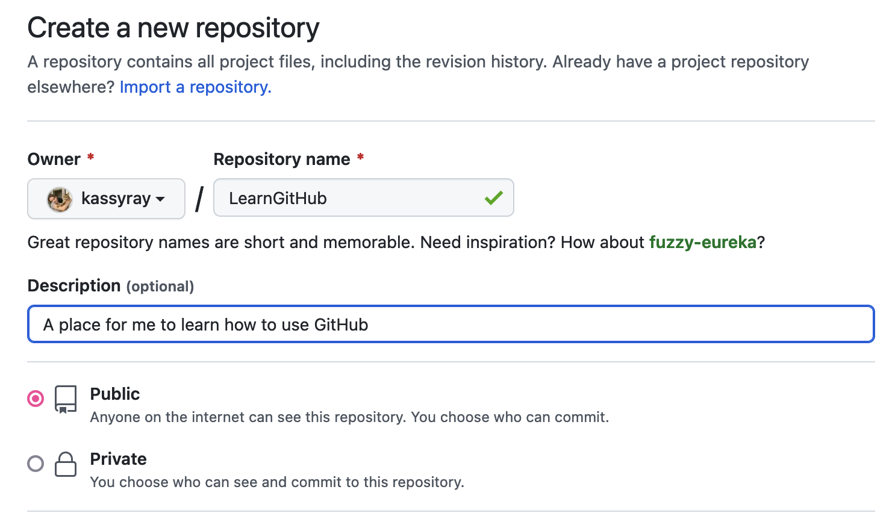
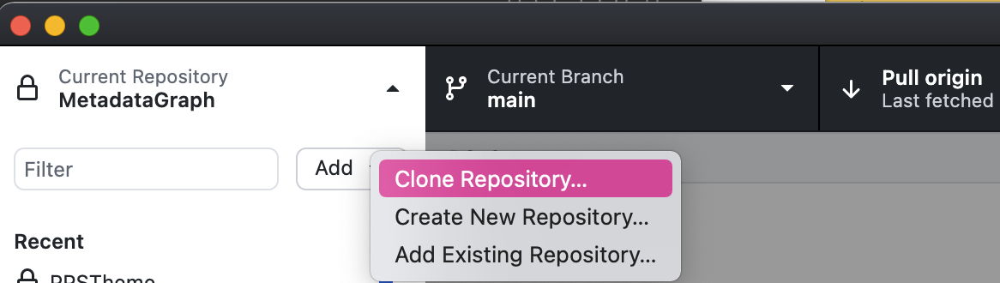
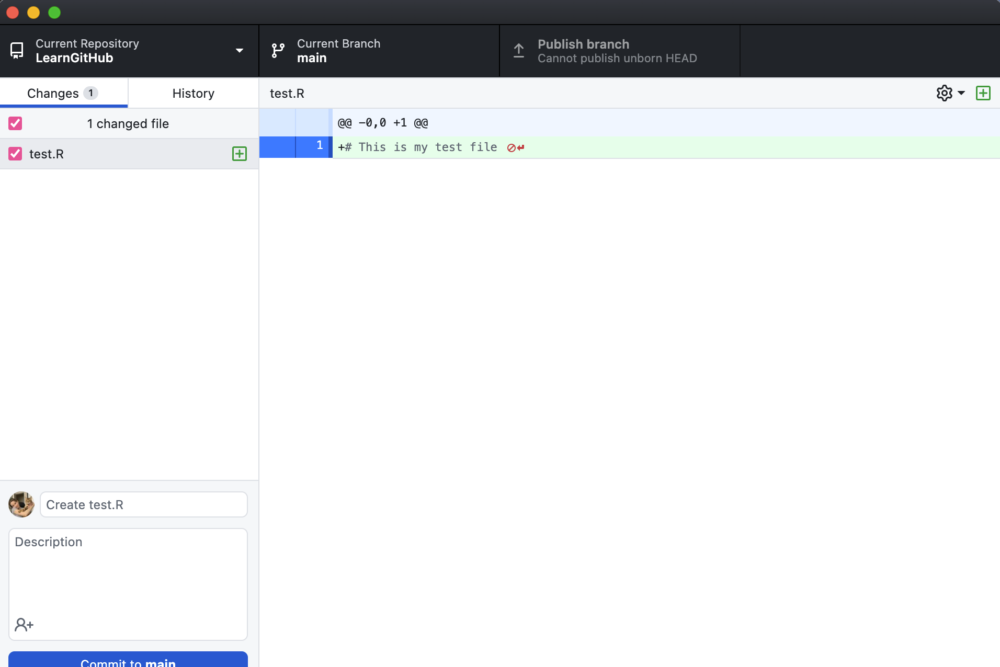
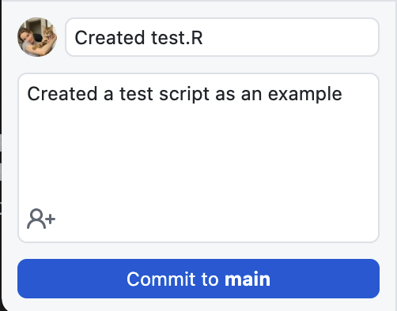
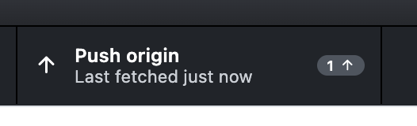

# Matériel pédagogique et meilleures pratiques

## Meilleures pratiques pour le codage

Les membres du GBADs utilisent le plus souvent R et Python pour coder, nettoyer et organiser les données, ainsi que pour construire leurs modèles. Les meilleures pratiques en matière de conventions de codage permettent au code d'être lisible et réutilisable. Ce sont les meilleures pratiques suggérées par GBADs Informatics et les modélisateurs pour garantir que nous pouvons comprendre et utiliser le code.


<!---

James et Gemma - cette zone est commentée dans le fichier de démarque. Quand vous voyez « avertissement » dans le texte, cela signifie simplement qu'une petite case non apparaît !

· Commentaire avec le nom du créateur, la date (au format ISO 8601 ? Par exemple 20210729), ce que contient le script (par exemple analyse en composantes principales) ?

· Bibliothèques chargées dans le script R

· Définir le répertoire de travail ?

· Les données doivent être « rangées » à la fin du processus de nettoyage (voir Data Governance Handbook ou R pour Data Science)

· Organisez les données de gauche à droite avec des variables catégorielles puis des variables continues. Les variables doivent être regroupées le cas échéant (par exemple, densité de peuplement au moment de l'éclaircie, poids à l'éclaircie, date de l'éclaircie, etc.) ?

· Supprimez les colonnes non pertinentes de l'ensemble de données (par exemple, longitude et latitude)

· Code bien documenté

· Utilisez la convention de dénomination de fichier standard (par exemple 20210617_FAO_ProductionPrices_Poultry_Ethiopia_metadata.csv, PAS les prix de production de la FAO - téléchargés par Kassy le 25 avril.csv)

· Snake pour nommer des objets dans R (par exemple Majority_Parent_Flock_Old)

· Les objets doivent avoir un nom significatif


--->

### Bonnes pratiques de codage R

#### 1. Conventions de dénomination

**Nom du fichier**

Les conventions de dénomination standard sont utilisées pour le nom de fichier et pour toutes les variables et fonctions définies dans votre code.

Les noms de fichiers doivent suivre le format `dateOfCreation_meaningfulCodeName.R`.

Par exemple, si mon code nettoie et reformate les données d'élevage, je pourrais appeler mon script « 20210703_faoLivestockProductionDataCleaning.R ».

---

Pour en savoir plus sur notre convention standard de date et d'heure, consultez [convention standard de date et d'heure](https://gbadskedoc.org/docs/Data-Governance-Handbook-for-GBADs/educationalMaterials#standard-date-and-time-convention )

---

**Nom des variables**

Utilisez `snake_case` pour nommer les variables et les fonctions dans votre code. L’utilisation d’une convention de dénomination standardisée améliore la lisibilité et l’interprétabilité du code.

<!--Les conventions de dénomination doivent également être utilisées lors de la déclaration de variables ou de la création de fonctions. Bien qu'il existe plusieurs conventions de dénomination populaires, notamment camelCase, PascalCase et Snake_case, par exemple, la convention convenue pour les GBAD est l'utilisation de Snake_case. -->

Utilisez des noms significatifs lorsque vous nommez des variables et des fonctions. Le nom de l'objet doit refléter son utilité ou ses caractéristiques. Par exemple, si vous lisez dans un dataframe de production animale :

```
bétail_df <- read_csv('path/to/my/important/file.csv')
```

```{avertissement} Soyez prudent lors de la configuration du répertoire de travail
N'oubliez pas que lorsque vous utilisez `setwd()` pour définir le répertoire de travail de votre projet ou script, le répertoire de travail est distinct de votre ordinateur et peut diminuer le niveau de reproductibilité de votre code.
```

#### 2. Organisez le format de votre code

Commencez votre script avec le nom du créateur, la date de la dernière modification du script (en ISO 8601) et une brève description de l'objectif du script.

```
####################################
# Créateur : Kassy Raymond
# Courriel : kraymond@uoguelph.ca
# Date de dernière modification : 20210803

# Ce programme contient du code qui effectue une analyse en composantes principales (PCA)
# sur les données sur la production animale en Éthiopie. Les données qui ont été utilisées dans ce
# programme provient de l'ensemble de données de production de FAOSTAT et a été téléchargé sur
#2021-08-03. Les données de sortie de ce script seront utilisées dans un modèle qui
# calcule la biomasse.

####################################
```

Documentez votre code avec des commentaires afin que le lecteur de votre code (ou futur vous) puisse suivre chaque étape que vous avez suivie dans votre script.

Chargez dans toutes les bibliothèques au début de votre programme. En R, cela pourrait ressembler à ceci :

```
## 0 - Charger dans toutes les bibliothèques

bibliothèque (tidyverse)
bibliothèque (ggplot2)
bibliothèque (tricot)
bibliothèque (lecture)
bibliothèque(forcats)
bibliothèque (dplyr)
```

Lorsque cela est possible, segmentez votre code en sections. Cela contribue à la reproductibilité et rend le code plus lisible.

```
## 0 - Charger dans toutes les bibliothèques

bibliothèque (tidyverse)
bibliothèque (ggplot2)
bibliothèque (tricot)
bibliothèque (lecture)
bibliothèque(forcats)
bibliothèque (dplyr)

## 1 - Fichiers sources

data_path <- 'chemin/vers/mon/important/fichier.csv'
bétail_df <- read_csv(data_path)

## 2 – Nettoyage des données

# Supprimez les colonnes inutiles

# Vérifier les NA

# Explorez les données et recherchez les valeurs aberrantes ou les erreurs dans les données

##3 – Modélisation

```

#### 3. Nettoyage des données

##### 3.1 Supprimez les colonnes inutiles dès le début de votre code

Si vous n'utilisez pas de colonne dans une analyse plus approfondie, déposez-la dans la phase de nettoyage et d'exploration des données de votre script. Cela améliorera l’interprétabilité de votre code et augmentera la vitesse de traitement de votre programme.

##### 3.2 Mémoriser la provenance des données

Il est important que les estimations, les modèles, les graphiques et les ensembles de données de sortie créés par les modèles puissent être reproduits. Il est donc important d'inclure l'ensemble de données d'origine utilisé, ou, lorsque des API sont utilisées, la possibilité de remonter à l'ensemble de données d'origine.

Si vous avez téléchargé vos données, assurez-vous d'enregistrer une copie de l'ensemble de données d'origine et **ne l'écrasez pas** dans votre flux de travail.

Si un appel d'API a été effectué pour obtenir les données, assurez-vous que l'horodatage de cet appel est fourni dans le nom de votre ensemble de données de sortie, de vos modèles ou de vos graphiques créés. Vous pouvez également à nouveau choisir de sauvegarder une copie de l'ensemble de données d'origine.

##### 3.3 S'assurer que les données sont dans un format « bien rangé » à la fin de la phase de nettoyage des données

Voir également Organiser des feuilles de calcul dans ces supports pédagogiques et [R pour Data Science](https://r4ds.had.co.nz/) par Hadley Wickham.

##### 3.4 Organiser les données

Organisez les données de gauche à droite avec des variables catégorielles puis des variables continues. Les variables doivent être regroupées lorsque cela est pertinent (par exemple, densité de peuplement à l'éclaircie, poids à l'éclaircie, date de l'éclaircie, etc.)

#### 4. Autres recommandations

- Essayez RStudio pour votre IDE !


## Organisation des données dans des feuilles de calcul

> "Déchets entrants, déchets sortants"

Si vous lisez ceci, vous passez probablement beaucoup de temps à traiter des données. Vous pouvez le collecter, le nettoyer, le modéliser, le partager, tenter de l'interpréter, puis tout recommencer. Lorsque vous recevez des données d'un collègue, vous pouvez essayer de les nettoyer à nouveau (même si elles ont déjà été nettoyées), essayer de les interpréter et même devoir écrire plusieurs e-mails pour interpréter les données.

**Dans cette partie du manuel, nous vous expliquons comment mieux organiser vos données dans des feuilles de calcul pour créer des données de meilleure qualité, conduisant à des modèles de meilleure qualité. Nous définissons également certaines pratiques standard pour la saisie de données de types spécifiques, notamment les dates et les nombres longs.**

### Feuilles de calcul et ensembles de données

Les feuilles de calcul, telles que celles créées dans Microsoft Excel et Google Sheets, sont courantes pour stocker, saisir, partager et manipuler les données issues de la recherche. Les feuilles de calcul sont généralement partagées pour communiquer les résultats de la recherche et utilisées comme données d'entrée pour les modèles ou l'analyse statistique. Bien que les feuilles de calcul fassent partie intégrante du cycle de vie des données, elles doivent être correctement structurées pour garantir qu'aucune erreur ne soit commise qui empêcherait la réutilisation ou l'interprétation des données. De petites erreurs dans les feuilles de calcul peuvent nous placer dans des situations où les données sont difficiles à comprendre, difficiles à analyser et longues à nettoyer.

---
**NOTE**

Veuillez contacter l'équipe informatique du GBADs si vous êtes membre du GBADs et que vous disposez de nombreuses feuilles de calcul contenant des données « en désordre » ! Nous pouvons consulter et réfléchir à la manière de créer un programme qui traitera et transformera vos données dans un format ordonné !

---

Structurer correctement les données dans des feuilles de calcul conduit à des données plus réutilisables et interopérables (FAIR), conduisant à des données de meilleure qualité et, en fin de compte, à une meilleure recherche. En configurant dès le départ des feuilles de calcul à intégrer dans des logiciels ou des bibliothèques statistiques, nous pouvons minimiser la confusion et simplifier nos flux de travail.

---

Objectifs d'apprentissage
* Les lecteurs doivent comprendre comment structurer un ensemble de données dans une feuille de calcul d'une manière qui prend en charge les principes de données FAIR.
* Les lecteurs doivent comprendre comment structurer leur ensemble de données pour préserver la sémantique (sens sous-jacent) des données
* Les lecteurs doivent comprendre comment structurer les dates et les nombres longs dans des feuilles de calcul et pourquoi il est important que ces données soient lisibles par machine.
* Les lecteurs doivent comprendre les erreurs courantes qui génèrent des ensembles de données désordonnés et comment les éviter.

---

### Structure de données


> "Les ensembles de données bien rangés se ressemblent tous, mais chaque ensemble de données désordonné est désordonné à sa manière."

> -- [Hadley Wickham](http://hadley.nz/)


En général, un ensemble de données ordonné ou propre est composé des éléments suivants [^1] :


**Colonnes (Variables)**

* Les colonnes sont un groupe de cellules alignées verticalement. Dans les ensembles de données, les colonnes sont des variables, où chaque cellule contient une information sur un attribut donné.

**Lignes (Observations)**

* Les lignes sont un groupe de cellules alignées horizontalement, où chaque ligne est une observation.

**Cellules (valeurs)**

* Dans les ensembles de données, chaque ligne est une observation et chaque cellule de cette ligne contient la valeur de la colonne où elle se trouve.


Des règles qui créent un ensemble de données bien rangé : les colonnes sont des variables, les observations sont des lignes et les valeurs sont des cellules. Image et légende de [^1].

S'en tenir à un format de données ordonné permet la réutilisabilité des données, garantit la cohérence (ce qui améliore la qualité des données) et aide à comprendre la signification sous-jacente (sémantique) de chacune des valeurs de la feuille de calcul. Avoir des colonnes comme variables et des lignes comme observations nous permet de savoir ce que signifie une valeur en fonction de sa relation avec les variables et les observations.

Les données FAIR sont des données ordonnées : les données ordonnées sont réutilisables et interopérables par nature. Des données ordonnées sont plus faciles à trouver, car les en-têtes sont bien définis, ce qui facilite la création de métadonnées. Fondamentalement, nous pouvons tirer davantage d’informations à partir de données ordonnées.

### Enregistrer des feuilles de calcul

Les ensembles de données dans les feuilles de calcul peuvent être enregistrés sous forme de fichier Excel ou au format « .csv » (valeurs séparées par des virgules) ou « .txt ». Les deux derniers sont préférés car ils sont plus faciles à lire dans les bibliothèques de programmation en R et python.

### Convention standard de date et d'heure

Sans convention standard, les dates peuvent présenter beaucoup d’ambiguïté. Par exemple, 01/11 pourrait être interprété comme janvier 2011, novembre 2001 ou 1er novembre. Pour cette raison, il est important d’utiliser une norme de date acceptée au niveau international afin que nous puissions comprendre nos données de manière fiable.

Les GBAD utiliseront la norme [ISO 8601](https://www.iso.org/iso-8601-date-and-time-format.html) pour les dates. ISO 8601 est une norme internationalement acceptée qui utilise le [calendrier grégorien](https://en.wikipedia.org/wiki/Gregorian_calendar).

Les dates sont représentées comme suit :
- AAAA-MM-JJ ou AAAAMMJJ

La norme ISO 8601 utilise le format 24 heures. Les temps peuvent donc être saisis comme suit :

- T[hh:mm:ss]

ou si les secondes ne sont pas applicables :

- T[hh:mm]

et si le procès-verbal n'est pas applicable :

- T[hh]

Étant donné que GBADs est une organisation mondiale, il est important de spécifier les fuseaux horaires en entrant l'heure dans les feuilles de calcul. Les fuseaux horaires sont spécifiés après la date en spécifiant le retard ou l'avance du fuseau horaire par rapport à UTC.

Par exemple:
Le samedi 10 juillet 2021 à 13h48 HAE s'écrit 2021-07-10T13:48-4:00


---
**Différents calendriers pour différents pays**

Lorsque vous analysez des ensembles de données de différents pays, sachez que toutes les régions du monde n'utilisent pas le calendrier grégorien.

Par exemple, l’Éthiopie utilise le calendrier éthiopien, différent du calendrier grégorien. Cela place l’Éthiopie avec 7 ans de retard sur le calendrier utilisé en Europe et en Amérique du Nord. [Ici](https://melaku.ml/) est un outil qui vous permet de convertir du calendrier grégorien au calendrier éthiopien.

---

### Conventions sur un grand nombre

Selon les pays, il existe différentes conventions pour les grands nombres.

Par exemple le nombre 133333.450 peut être représenté de différentes manières :

Dans les pays anglophones, le numéro pourrait ressembler à ceci :
- 133 333.450

Dans les pays non anglophones, comme ceci :
- 133.333.450

Donc - le même nombre mais représenté de 3 manières différentes. Cela laisse beaucoup de place à l'interprétation, d'autant plus que la valeur par défaut lors de la lecture de la plupart des fichiers dans les langages de programmation statistique suppose qu'une virgule spécifie une nouvelle colonne. Et comme une grande partie du travail effectué par GBAD repose sur des langages de programmation tels que R et Python, il est vraiment important de structurer nos nombres afin qu'ils puissent être facilement lus, interprétés et lus également par les machines !

Pour que les choses restent claires, nous devons structurer nos grands nombres **sans** virgules et réserver des points pour spécifier une décimale.


---
Si vous voyez une virgule là où vous pensez qu'elle ne devrait pas être...

Si le formatage des grands nombres n'est pas clair pour vous, demandez des éclaircissements au propriétaire des données ! Si le propriétaire des données fait partie du programme GBADs, suggérez-lui gentiment d'utiliser les normes utilisées et définies par le programme (vous pouvez même envoyer ce chapitre).

---

### Convention de dénomination des fichiers

Lorsque vous nommez des fichiers, vous devez être cohérent, être descriptif, éviter les caractères et les espaces et inclure la date (de préférence en utilisant une norme telle que [ISO 8601](https://www.iso.org/iso-8601-date-and- time-format.html). Aux fins de la convention de dénomination des fichiers, nous omettrons les tirets entre AAAA-MM-JJ.

**Exemples de bonnes conventions de dénomination de fichiers :**

Lorsqu'il s'agit de données téléchargées depuis des organisations :
* AAAAMMJJ_organization_topic_species_country
* 20210617_FAO_ProductionPrices_Poultry_Ethiopie.csv
* 20210617_WorldBank_LSMS_Ethiopie.csv

Où AAAAMMJJ est la date à laquelle vous avez téléchargé le fichier.

S'il s'agit d'un fichier de métadonnées, vous devez nommer le fichier avec « métadonnées » et le nom de fichier comme ci-dessus pour savoir quel fichier de métadonnées correspond à l'ensemble de données approprié. Par exemple:

* 20210617_FAO_ProductionPrices_Poultry_Ethiopia_metadata.csv
* 20210617_WorldBank_LSMS_Ethiopie_metadata.csv

**Exemples de fichiers mal nommés :**
* Prix de production de la FAO - téléchargé par Kassy le 25 avril.csv
* Prix de production éthiopiens tirés du site Web de la FAO Stat.csv
* ETHPRODPRICES_GOODCOPY.csv


---
**Dates en premier**

Mettre la date en premier dans un fichier vous permet d'organiser facilement les fichiers dans un répertoire ou un dossier par date ascendante ou décroissante.

---

### Erreurs courantes

Le formatage, le surlignage et la mise en gras doivent être évités. Voici pourquoi la création de jolies feuilles de calcul provoque des maux de tête dans le cycle de vie de l'analyse des données :

#### 7 erreurs courantes qui rendent les feuilles de calcul compliquées

1. Plusieurs tableaux dans une seule feuille de calcul
2. Mauvaises valeurs nulles (un zéro ne signifie pas nul)
3. Les cellules sont fusionnées
4. Les unités de mesure sont incluses dans les valeurs au lieu des noms de colonnes
5. Le formatage est utilisé pour représenter les informations
6. Les cellules contiennent plus d’une information
7. Le format de date standard n'est pas utilisé

***1. Plusieurs tableaux dans une seule feuille de calcul***

Avoir plusieurs tableaux dans une seule feuille de calcul conduit souvent à un nettoyage inutile des données pour tout traitement ultérieur des données. Plusieurs tableaux dans une seule feuille de calcul prêtent à confusion lorsque nous partageons la feuille de calcul ou y revenons plus tard. Si une ligne est une observation, la création de plusieurs tableaux va à l'encontre de cette notion, réduisant la qualité et la capacité à interpréter l'ensemble de données.

Dans l’exemple ci-dessous, composé de données fabriquées, il y a 4 tableaux dans une seule feuille de calcul. Dans chaque tableau, l'« élément » correspond à l'observation et le nombre d'animaux vivants au cours d'une année donnée correspond à ce qui est mesuré. Cependant, en raison de la façon dont la feuille de calcul est configurée, il est difficile de savoir si les deux tableaux du haut sont associés au Canada ou s'il manque un en-tête dans le tableau de droite.


Une meilleure façon de configurer les données serait la suivante :


Ici, nous voyons que toutes les informations sont toujours fournies, mais chaque ligne est une observation pour un pays, un élément et une année donnés. En plus d'améliorer l'interprétabilité des données, ces données peuvent désormais être saisies dans un logiciel statistique tel que R sans nettoyage approfondi des données.

***2. Mauvaises valeurs nulles***

Les valeurs manquantes ou nulles doivent être indiquées d'une manière standard qui se distingue d'une valeur quantitative de 0. De cette façon, le lecteur de l'ensemble de données comprendra quelles données sont manquantes ou inconnues et lesquelles ont une valeur de 0. La chose la plus importante lors de l'enregistrement des données manquantes les valeurs sont la cohérence; si vous décidez d'utiliser « NA » pour désigner les valeurs manquantes, assurez-vous de ne pas passer aux minuscules (« na ») ou à « Non applicable » plus tard dans la feuille de calcul.

Selon le logiciel statistique utilisé, la signification de « NA » peut varier. Par exemple, dans R, « NA » est un terme réservé pour une valeur manquante. La façon dont les valeurs « NA » sont représentées en python varie en fonction de la bibliothèque utilisée. Dans pandas (une bibliothèque Python populaire pour l'analyse, le nettoyage et la gestion des données), les valeurs « NA » sont représentées par « NaN » ou « None ». Cependant, tant que nous sommes cohérents dans la manière dont nous représentons les valeurs « NA » lors de la saisie et de l'analyse des données, nous pouvons rapidement changer de format en fonction du logiciel de statistique ou de programmation que nous avons choisi.

***3. Les cellules sont fusionnées***

La fusion de cellules va à l'encontre de la notion selon laquelle les lignes sont des observations et chaque colonne est une variable. Non seulement la fusion de cellules va à l’encontre de ces principes, mais elle rend également impossible le tri des colonnes et des lignes, provoque des erreurs lors de la lecture des données dans les logiciels statistiques et introduit le risque d’une mauvaise interprétation des données ou d’une perte d’informations. Par exemple, l’utilisation de cellules fusionnées pour relier deux lignes entre elles provoque une confusion lorsque vous revenez à l’examen des données. Ou, si le formatage fusionné est perdu, vous risquez de perdre une observation entière ou des variables dans une observation donnée.

***4. Les unités de mesure sont incluses dans les valeurs au lieu des noms de colonnes***

Comme chaque colonne représente une variable, les unités de mesure doivent être cohérentes dans toute cette colonne. Par conséquent, le cas échéant, vous devez inclure l’unité de mesure dans l’en-tête de colonne.

***5. Le formatage est utilisé pour représenter les informations***

La mise en surbrillance des cellules et la mise en gras ou en italique des informations doivent être évitées pour représenter les informations dans un ensemble de données. Ceci est problématique car si le formatage est perdu, vous perdez des informations précieuses. Si vous souhaitez inclure les informations articulées par le formatage dans votre modèle ou analyse, vous devrez nettoyer la feuille dans Excel avant de la lire dans votre logiciel.

Par exemple, lors du test d’échantillons pour détecter une maladie, on peut utiliser la mise en évidence pour montrer quels échantillons se sont révélés positifs. Si le formatage est perdu ou si quelqu'un ne connaît pas le contexte de la signification de la surbrillance, ces informations sont perdues.

***6. Les cellules contiennent plusieurs informations***

Lorsque les cellules contiennent plusieurs informations, cela limite la manière dont vous pouvez analyser un ensemble de données préexistant et conduit généralement à un nettoyage accru des données. Par exemple, vous pourriez signaler des types et des décomptes de races dans votre ensemble de données.

Dans ce cas, vous souhaiterez déclarer la race et compter dans des colonnes séparées comme ceci :

| Race | Comte | Ferme | DateCompté |
| :---: | :---: | :---: | :---: |
| Aberdeen Angus | 20 | Fermes bovines canadiennes | 2021-06-01 |
| Abergèle | 60 | Fermes bovines canadiennes | 2021-06-01 |
| Limousin | 10| Fermes bovines canadiennes | 2021-06-01 |

Plutôt que de les signaler dans la même cellule, comme ceci :

| Nombre de race | Ferme | DateCompté |
| :---: | :---: | :---: |
| 20 Aberdeen-Angus | Fermes bovines canadiennes | 2021-06-01 |
| 60 Abergèle | Fermes bovines canadiennes | 2021-06-01 |
| 10 Limousin | Fermes bovines canadiennes | 2021-06-01 |


***7. Le format de date standard n'est pas utilisé***

Lors de la saisie de dates, utilisez une norme telle que [ISO 8601](https://www.iso.org/iso-8601-date-and-time-format.html) (AAAA-MM-JJ). Cela vous permet de trier par date, d'améliorer l'interprétabilité et, si nécessaire, de convertir facilement vers d'autres formats de date. Reportez-vous à la section **Convention standard de date et d'heure** de cette section pour plus d'informations sur la façon dont GBADs aborde la saisie des dates et des heures.

De plus, lorsque vous utilisez des dates, assurez-vous de préciser ce que signifie la date. Un en-tête de colonne simplement intitulé « date » ne fournit pas beaucoup de contexte. Par exemple, la date signifie-t-elle la date à laquelle les données ont été saisies dans la feuille de calcul ? La date à laquelle un échantillon a été prélevé ? La date à laquelle un échantillon a été analysé en laboratoire ? Assurez-vous que les autres chercheurs (et vous-même à l’avenir) savent de quoi vous parlez !

#### Recommandations de lectures complémentaires
[R pour Data Science par Hadley Wickham](https://r4ds.had.co.nz/)

Auteurs : Kassy Raymond et K. Marie McIntyre

## Tutoriel GitHub


GitHub est l'endroit où GBADs stocke tout le code produit dans GBAD, y compris le code de développement logiciel, le nettoyage et le reformatage des données, le développement d'API, la modélisation, le développement de tableaux de bord et le code d'accès aux données. Nous proposons ici un bref didacticiel sur les bases de GitHub et une liste de ressources pédagogiques pour ceux qui utiliseront GitHub plus régulièrement.

### Liste des ressources

Voici une liste de certaines de nos ressources préférées pour démarrer avec GitHub :

#### Tutoriel YouTube utile

* [Tutoriels GitHub du train de codage](https://www.youtube.com/watch?v=BCQHnlnPusY&list=PLRqwX-V7Uu6ZF9C0YMKuns9sLDzK6zoiV)

#### Livres électroniques pour GitHub

* [Introduction à Git et GitHub](https://github.com/bobbyiliev/introduction-to-git-and-github-ebook) par Bobby Ilieu
* [Happy Git et GitHub pour l'utilisateur](https://happygitwithr.com/index.html) par Jenny Byran

#### Articles de blog/tutoriels rapides

* [Démarrer avec GitHub Desktop](https://docs.github.com/en/desktop/installing-and-configuring-github-desktop/overview/getting-started-with-github-desktop)
* [Débutants : contribuer à un projet GitHub avec GitHub Desktop](https://medium.com/nerd-for-tech/contributing-to-a-github-project-with-github-desktop-57514f640aa1)
* [2 minutes pour configurer Git, GitHub et GitHub Desktop sur Mac](https://medium.com/swlh/2-minutes-to-set-up-git-github-and-github-desktop-on-mac -b10267003d77)

### Tutoriel/Aperçu

Dans ce didacticiel, vous apprendrez à utiliser GitHub Desktop pour travailler en collaboration sur des projets de codage et profiter des avantages du contrôle de version.

Dans la première partie de ce didacticiel, nous allons créer un nouveau référentiel GitHub et utiliser les fonctions de GitHub pour créer des modifications et apprendre la terminologie GitHub. Ensuite, nous présenterons le référentiel GitHub utilisé pour l'enveloppe de perte de santé animale (AHLE) et comment vous pouvez commencer à y collaborer.

---

**Objectifs d'apprentissage:**

* Créer un dépôt sur GitHub
* Cloner des référentiels sur votre machine locale
* Créer des modifications, valider et transmettre les modifications sur GitHub
* Récupérez et extrayez de nouvelles modifications pour mettre à jour votre référentiel local

**Modélisation dans les GBAD :**

* Cloner le référentiel AHLE
* Apporter des modifications et les valider
* Extrayez les modifications que vos collaborateurs effectuent sur le référentiel

---

#### Conditions préalables

Pour suivre ce tutoriel vous devez :

* Être inscrit pour un compte GitHub
* Installer le bureau GitHub

** Inscrivez-vous pour un compte GitHub **

Si vous n'avez pas encore de compte sur GitHub, vous pouvez en créer un en visitant [GitHub](https://github.com/) et en cliquant sur le bouton « S'inscrire » sur le côté droit de l'écran.

**Installer le bureau GitHub**

Vous pouvez installer GitHub Desktop à partir de [https://desktop.github.com/](https://desktop.github.com/). Assurez-vous de sélectionner la version Windows si vous utilisez Windows ou MacOS si vous utilisez un Mac. Suivez les instructions d'installation sur le lien fourni.

Vous êtes maintenant prêt à commencer à utiliser GitHub !

#### Créer un dépôt sur GitHub

Créez un nouveau référentiel sur GitHub en accédant à votre profil sur [https://github.com](https://github.com) et en sélectionnant le bouton vert « nouveau » sur le côté droit de votre écran :


Nommez votre référentiel « Tutoriel GitHub ». Ajoutez une description telle que : "Un endroit pour que j'apprenne à utiliser GitHub".



Vous disposez désormais d’un référentiel sur GitHub ! Nous devons maintenant le configurer sur votre machine locale.

#### Cloner un dépôt

Le mot « clone » signifie obtenir une copie du référentiel sur GitHub sur votre machine locale afin de pouvoir accéder au référentiel.

1. Ouvrez l'application de bureau GitHub.
2. Sélectionnez le volet à gauche de la fenêtre de l'application et appuyez sur le bouton « Ajouter ».


3. Appuyez sur « cloner le référentiel »



4. Copiez et collez l'URL du référentiel que vous avez créé sur GitHub et spécifiez le chemin où vous souhaitez le placer.

J'ai mis le référentiel dans mon dossier Tutoriels dans un dossier que j'ai appelé LearnGitHub. Sélectionnez ensuite « Cloner ».


Vous avez maintenant une copie de votre référentiel GitHub sur votre machine locale ! La prochaine chose que vous apprendrez à faire est d'ajouter des fichiers à votre référentiel.

#### Ajouter à votre référentiel

Créez un fichier à ajouter à votre référentiel GitHub.

Par exemple, vous pouvez ajouter un script R. Ouvrez RStudio et créez un nouveau fichier. Enregistrez votre fichier dans le répertoire où se trouve votre référentiel GitHub. Par exemple, je sauvegarderais le mien dans /Users/kassyraymond/PhD/trunk/Tutorials/LearnGithub


Désormais, lorsque j'ouvrirai l'application GitHub Desktop, je verrai que le fichier que j'ai créé appelé test.R apparaît dans le volet gauche de la fenêtre.



Ce fichier n'est enregistré que localement, donc pour obtenir le fichier dans GitHub (le référentiel distant), je dois valider mes modifications et les transmettre au référentiel distant.

#### Valider et pousser les changements

**Commit Git**

Pour valider vos modifications, vous pouvez ajouter un titre. Dans ce cas, mon titre pourrait ressembler à "Created test.R". Ensuite, vous pouvez ajouter une description de ce que vous avez fait, des modifications que vous avez apportées à votre script ou de ce que vous ajoutez au référentiel.



**Git Push**

La prochaine chose que vous devez faire est de « pousser » vos modifications vers le référentiel GitHub distant. Cela rend vos modifications disponibles sur le référentiel distant afin que vos collaborateurs puissent voir les modifications que vous avez apportées et travailler sur la version la plus à jour de votre code.



#### Récupérer et extraire de nouvelles modifications

Lorsque vous travaillez sur le même projet avec des collaborateurs et qu'ils envoient de nouvelles modifications à GitHub, ces modifications sont stockées dans le référentiel distant. Pour travailler sur la dernière version du code, vous devez récupérer et extraire les nouvelles modifications dans le référentiel GitHub.

Pour obtenir les nouvelles modifications, appuyez sur le bouton « récupérer » en haut de la fenêtre du bureau GitHub :


### Collaborer sur AHLE GitHub

Maintenant que vous connaissez les bases de GitHub, vous êtes prêt à commencer à collaborer sur AHLE GitHub.

Tout d’abord, vous souhaiterez cloner le référentiel AHLE GitHub.

Vous allez donc accéder au référentiel AHLE GitHub : https://github.com/GBADsInformatics/GBADsLiverpool et copier l'URL (ou simplement la copier à partir de ce tutoriel.)

Ensuite, vous ouvrirez GitHub Desktop et clonerez le référentiel, comme nous l'avons fait dans la section précédente.

Maintenant, si vous ouvrez votre navigateur de fichiers, vous verrez le référentiel AHLE GitHub. Vous pouvez apporter des modifications à n'importe quel fichier en l'ouvrant. Lorsque vous apportez une modification, vous pouvez valider et transmettre vos modifications à vos collaborateurs. Pour obtenir toutes les modifications de vos collaborateurs, vous pouvez récupérer et extraire les modifications !

### Les références
[^1] : https://www.jstatsoft.org/article/view/v059i10
