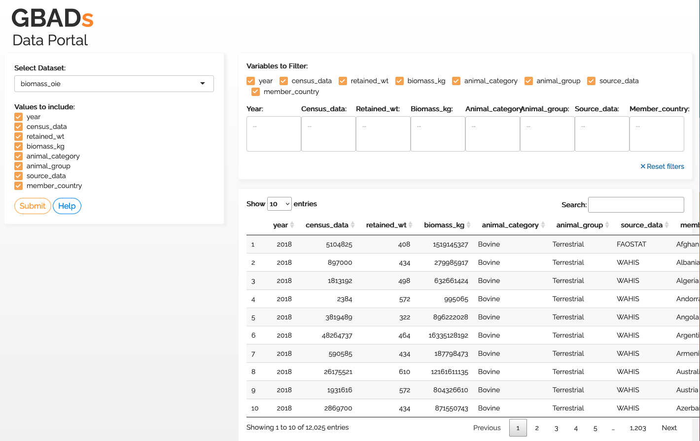

# Accéder aux données dans le moteur de connaissances

## Objectifs:

* Comprendre comment accéder à différents types de données dans le Knowledge Engine
* Comprendre comment rechercher des données stockées dans le Knowledge Engine

Pour plus d'informations sur la marche à suivre lorsque vous identifiez de nouveaux ensembles de données intéressants à utiliser dans le programme GBADs, visitez la section Contributeur de données du Manuel de gouvernance des données qui décrit les éléments suivants :

* Comprendre les rôles et les responsabilités des personnes qui ont identifié un nouvel ensemble de données pour l'utilisation du programme GBADs, et comment stocker ces données dans le moteur de connaissances.
* Comprendre comment l'informatique stocke les données des modèles dans le moteur de connaissances

---

Les moyens d'accéder aux données prennent en compte la possibilité de trouver, l'accessibilité, l'interopérabilité et la réutilisation des données pour les **humains** et les **machines**.

---


## Types de données dans le moteur de connaissances

Le guide de l'utilisateur des données fournit aux collaborateurs du GBAD un aperçu de la manière d'accéder aux données dans le moteur de connaissances. Nous disposons de 3 grands types de données :

1. Données d'entrée (ou données brutes)
2. Données de sortie des modèles
3. Ensembles de données intermédiaires

Chaque type de données et leurs sous-ensembles sont formatés de manière unique et nécessitent des exigences de stockage spécifiques pour garantir que les données peuvent être trouvées, accessibles, interopérables et réutilisables (FAIR) ; toutes les données doivent être documentées avec des métadonnées pour garantir qu'elles sont JUSTE.

### Des données d'entrée

Les données d'entrée ou les données brutes peuvent se présenter sous deux formes dans le programme GBADs :

* Ensembles de données provenant de sources telles que la base de données statistiques de l'Organisation des Nations Unies pour l'alimentation et l'agriculture (FAOSTAT), l'Organisation mondiale de la santé animale (WOAH), les agences nationales de statistiques, etc.
* Paramètres obtenus à partir de méta-analyses issues de revues systématiques.
* Ensembles de données produits à partir d'exercices de sollicitation d'experts.

Ces données sont les _entrées_ dans les modèles et les calculs produits par les thèmes GBAD. Les données d'entrée peuvent se présenter sous différentes formes, utiliser différentes terminologies et normes pour nommer les pays, les espèces ou d'autres classifications, et peuvent donc avoir diverses interprétations de leur signification.

Tous les thèmes et modélisateurs doivent utiliser les mêmes données d'entrée qui ont été nettoyées une seule fois pour garantir que nous utilisons tous les mêmes entrées dans les modèles. Cela garantit la reproductibilité et l’exactitude des données dans l’ensemble du programme.

### Données de sortie des modèles

Lorsque des modèles ou des estimations sont produits, ils produisent des paramètres et des ensembles de données qui peuvent être utilisés dans des modèles ou des estimations ultérieurs. Les données de sortie des modèles et des estimations doivent donc être stockées dans le moteur de connaissances avec les métadonnées pour garantir que tous les utilisateurs puissent comprendre comment les données ont été alimentées et produites, y compris le code du modèle et les ensembles de données utilisés pour alimenter ces données.

### Ensembles de données intermédiaires

Les ensembles de données intermédiaires peuvent être des données produites au cours d’une étape de modélisation ou d’imputation, mais qui ne sont pas considérées comme un produit final. Les données intermédiaires peuvent toutefois être utilisées pour d’autres processus de modélisation et peuvent être importantes pour garantir la reproductible des processus de données.

## Accéder aux données dans le Knowledge Engine

Il existe deux manières principales d'accéder aux données dans le Knowledge Engine :

1. Via l'interface de programmation d'applications (API)
2. Téléchargement direct via une URL à partir d'un compartiment Amazon S3

### API

---

**Qu'est-ce qu'une API ?**

API signifie Application Programming Interface. Il s'agit d'un moyen machine à machine de demander des données à un serveur, de demander au serveur de récupérer et d'interpréter les données et de les renvoyer à votre machine. Les API sont partout ; ils permettent aux applications de « communiquer » entre elles. Par exemple, lorsque vous consultez la météo sur une application météo, celle-ci utilise une API pour récupérer les données et les présenter de manière utilisable et interprétable sur votre téléphone. Les API fournissent les données les plus récentes sans avoir à stocker les données sur votre propre ordinateur.

Pour plus d'informations sur les API et comment les utiliser, visitez le [Tutoriel API GBADs](https://gbadskedoc.org/docs/GBADsAPITutorial).

---

Les données d'entrée et de sortie sont stockées dans des tables [Amazon RDS](https://aws.amazon.com/rds/). Les fonctionnalités actuelles de l'API incluent :

* Donne accès aux données contenues dans les bases de données publiques
* Fournit une liste de toutes les tables contenues dans les bases de données publiques
* Pour une table donnée, fournit les noms de tous les champs et les types de données de ces champs

Bien qu'il puisse y avoir une courbe d'apprentissage pour les utilisateurs humains de l'API, les API sont importantes pour fournir un accès de machine à machine aux données (garantir l'interopérabilité (échange d'informations) entre les systèmes).

La documentation sur la façon de créer des appels d'API est disponible sur la [Page de documentation du portail de données GBADs](http://gbadske.org/api/dataportal/).


Pour améliorer la facilité d'utilisation pour les utilisateurs humains, [Kurtis Sobkowich](https://www.linkedin.com/in/kurtis-sobkowich/?originalSubdomain=ca) a créé un tableau de bord pour afficher et télécharger les données de l'API GBADs. L'URL sera liée dans le manuel lorsque le tableau de bord sera servi sur le serveur GBADs. Pour l'instant, le tableau de bord est disponible sur le serveur R Shiny de Kurtis : (interface utilisateur de l'API GBADs)[https://kurtissobkowich.shinyapps.io/GBADs_API_UI/]. Veuillez vous attendre à des retards : le tableau de bord sera lent jusqu'à ce qu'il soit servi sur les serveurs des GBAD.



Nous avons également développé un tutoriel pour utiliser l'API GBADs dans R : [Accès à l'API GBADs dans R](https://gbadskedoc.org/docs/GBADsAPITutorial)

### Compartiments S3

---

**Qu'est-ce qu'un compartiment Amazon S3 ?**

Un [compartiment Amazon Simple Storage Service (S3)](https://docs.aws.amazon.com/AmazonS3/latest/userguide/Welcome.html) est un service de stockage d'objets cloud qui vous permet de stocker des données et d'autres objets numériques. dans le nuage.

---

Les données de l'API sont également disponibles via les compartiments Amazon S3. À l'aide de l'URL S3, les utilisateurs peuvent télécharger des versions CSV des données. De plus, nous stockerons les fichiers utilisés par les GBAD qui ne peuvent pas être stockés dans des tables RDS tels que les shapefiles, les images, les fichiers de données intermédiaires produits par les modèles, les données issues de méta-analyses et toute autre donnée qui ne peut pas être structurée dans une table RD.

L'URL S3 sera utilisée comme identifiant unique pour les données et sera disponible dans les métadonnées d'un ensemble de données. L'URL S3 sera alors détectable via l'API de métadonnées GBADs, et éventuellement l'interface utilisateur du catalogue de données (à venir).

Fichiers CSA S3 d’Éthiopie :

| Espèce | Lien S3 vers les instructions |
| ------- | ----------------------- |
| Chameaux | https://gbads-eth.s3.ca-central-1.amazonaws.com/CSA/camels-region-instructions.pdf |
| Bovins | https://gbads-eth.s3.ca-central-1.amazonaws.com/CSA/cattle-region-instructions.pdf |
| Ânes| https://gbads-eth.s3.ca-central-1.amazonaws.com/CSA/donkeys-region-instructions.pdf |
| Chèvres | https://gbads-eth.s3.ca-central-1.amazonaws.com/CSA/goats-region-instructions.pdf |
| Chevaux | https://gbads-eth.s3.ca-central-1.amazonaws.com/CSA/horses-region-instructions.pdf |
| Mules | https://gbads-eth.s3.ca-central-1.amazonaws.com/CSA/mules-region-instructions.pdf |
| Volaille | https://gbads-eth.s3.ca-central-1.amazonaws.com/CSA/poultry-region-instructions.pdf |
| Moutons | https://gbads-eth.s3.ca-central-1.amazonaws.com/CSA/sheep-region-instructions.pdf |

### Interface du portail de données GBADs

## Recherche de données dans le Knowledge Engine

Pour utiliser les données dans le Knowledge Engine, vous devez pouvoir les trouver. La fonctionnalité de recherche des données est construite à l'aide d'un pipeline de métadonnées.

Chaque type de données possède des métadonnées uniques qui le décrivent. Pour plus d'informations sur les métadonnées, veuillez visiter la section [Metadata](https://gbadskedoc.org/docs/Data-Governance-Handbook-for-GBADs/metadata) du manuel.

**L'API de métadonnées sera bientôt publiée avec des informations sur la façon de découvrir les sources de données stockées dans les GBADs KE sur la base d'informations descriptives décrivant les données**


<!-- Le [portail de données GBADs](http://gbadske.org:8050/dash/page-1/) est un prototype de tableau de bord qui permet aux utilisateurs d'accéder aux ensembles de données de [FAOSTAT](http://www.fao .org/faostat/en/) et [OIE WAHIS](https://wahis.oie.int/). Le prototype vous permet de sélectionner les données d'intérêt, de les visualiser sur des graphiques à barres, de télécharger les données au format « .csv » et « .json » et de voir l'appel de l'interface de programmation d'application (API). -->

<!-- ```{marge}
**Qu'est-ce que `.json` ?**

[JSON](https://en.wikipedia.org/wiki/JSON) signifie JavaScript Object Notation. JSON est un format de fichier qui stocke les données dans un format structuré standard, permettant aux données d'être lisibles à la fois par l'homme et par la machine. Les données JSON peuvent être lues dans tous les langages de programmation et analysées dans « Excel ». Les données JSON sont lisibles et plus faciles à analyser que d'autres formats de fichiers tels que [XML](https://en.wikipedia.org/wiki/XML).

```

````{marge}
```{avertissement} Nous voulons avoir de vos nouvelles !
:classe: conseil

Veuillez noter que cette page sera mise à jour à mesure que nous continuerons à améliorer notre portail de données et à accéder à davantage de sources de données. Nous apprécions vos commentaires sur ce que vous aimez dans le système, ce que vous aimeriez voir et tout ce qui, selon vous, pourrait être plus clair !
```
```` -->

<!-- ```{admonition} Objectifs d'apprentissage
* Les lecteurs doivent comprendre ce qu'est une API, comment elle fonctionne et pourquoi GBADs utilise des API
* Les lecteurs doivent comprendre comment utiliser l'API GBADs pour obtenir les données FAOSTAT et OIE WAHIS.
* Les lecteurs doivent comprendre comment utiliser l'API GBADs pour lire des données dans leurs programmes `R` et `python`
``` -->

<!-- ## Premiers pas avec notre API -->

<!-- ### Qu'est-ce qu'une API ?

Une interface de programmation d'application (API) est un moyen de machine à machine de demander des données à un serveur, de demander au serveur de récupérer et d'interpréter les données et de les renvoyer à votre machine. Les API sont partout ; ils permettent aux applications de « communiquer » entre elles. Par exemple, lorsque vous consultez la météo sur une application météo, celle-ci utilise une API pour récupérer les données et les présenter de manière utilisable et interprétable sur votre téléphone. Les API fournissent les données les plus récentes sans avoir à stocker les données sur votre propre ordinateur.

Pour les besoins en données des GBAD, les API fonctionnent comme ceci :
1. Vous/votre programme demandez des données via l'appel API
2. Le serveur Web recherche dans sa base de données interne les données que vous avez demandées
3. La base de données fournit au serveur les données que vous avez demandées
4. Les données vous sont renvoyées/à votre programme

### Votre workflow et vos API

Pour expliquer le concept d'API plus en profondeur, nous discuterons du flux de travail courant pour accéder aux données à des fins de modélisation et de l'endroit où les API entrent en jeu.

**Méthode d'accumulation manuelle des données**

Si vous n'utilisez pas d'API dans votre flux de travail actuel, l'accès aux données consiste probablement à naviguer vers un portail ou une source de données, à parcourir le catalogue de données ou à rechercher un ensemble de données qui vous intéresse, puis à télécharger les données. Chaque fois que les données sont mises à jour, vous devez répéter le processus, rechercher les données, les télécharger à nouveau, importer le fichier dans votre modèle et réexécuter avec les numéros mis à jour. Pendant que ce flux de travail fonctionne, l'utilisation d'API peut éliminer le travail manuel consistant à accéder au site Web et à obtenir les données à chaque fois que vous en avez besoin.

Lorsque vous interagissez avec le site Web pour obtenir les données souhaitées, vous interagissez probablement indirectement avec une API, qui fonctionne dans le backend pour obtenir les données que vous avez sélectionnées et les présenter à la page Web. Cependant, vous pouvez utiliser un **appel API** pour demander des données au serveur où résident les données qui vous intéressent {numref}`APIcall`.

```{marge}
Un **appel API** est la façon dont vous demandez des données à un serveur.
```

**Utiliser des API pour obtenir des données**

Au lieu de télécharger manuellement les données d'un site Web à chaque fois, vous pouvez intégrer des appels d'API dans votre flux de travail pour demander les données les plus récentes à la source. Cela vous permet de réexécuter le code sans avoir à modifier votre code.

```{figure} /images/API.png
:nom : appel API

Description simple du fonctionnement d'une API.
``` -->


<!--Si vous n’avez jamais utilisé d’interface de programmation d’application (API) auparavant, pas de panique ! Vous êtes au bon endroit. Avant d'expliquer comment utiliser notre API, nous expliquerons pourquoi nous pensons que les gens devraient adopter l'utilisation de l'API et ce qu'est même une API.

Vous avez peut-être déjà entendu parler d'une API et vous êtes demandé : qu'est-ce qu'une API ? Souvent, lorsque « API » est recherché sur Google, vous êtes submergé de jargon technique et de mots à la mode - ou d'informations adaptées aux ingénieurs logiciels et aux services techniques. Cependant, les API sont extrêmement utiles pour quiconque se rend activement sur un site Web et en télécharge des données. L'utilisation d'une API vous permet de faire en sorte que votre ordinateur communique avec un serveur Web et demande les données, sans accéder à ce site Web et télécharger ces données vous-même. Par exemple, vous pouvez dès maintenant vous rendre sur le portail de données de la Banque mondiale en accédant au site Web, en parcourant le catalogue de données ou en recherchant l'ensemble de données qui vous intéresse, puis en téléchargeant les données. Certes, cette méthode manuelle est un moyen valable d’interagir avec un serveur Web et vous permet d’obtenir les données souhaitées. Mais vous n’avez pas réellement besoin d’interagir avec un site Web de cette manière manuelle pour obtenir les données souhaitées. Les API vous permettent d'appeler le site Web et de demander les données souhaitées sans avoir à naviguer sur un site Web (ni même à ouvrir votre navigateur Web). Et, comme vous l’apprendrez, vous n’avez pas besoin d’avoir une solide expérience en programmation pour utiliser une API ! --->

<!--Les appels d'API sont effectués à l'aide de l'URI (Unique Resource Identifier) ​​de l'API. En termes simples, un URI est quelque chose qui distingue distinctement l'API des autres API. Vous pouvez considérer un URI comme tout ce qui identifie quelque chose parmi toutes les autres choses. Par exemple, votre numéro d'assurance sociale est votre URI qui permet au gouvernement de vous identifier parmi les autres citoyens. De même, vous remarquerez peut-être que personne d’autre n’a la même adresse e-mail que vous. Une adresse email est aussi une URI ! -->

<!--
Une fois que vous avez cet « appel API », vous pouvez simplement entrer dans le programme de votre choix, automatiser vos flux de travail et accéder aux données sans avoir à parcourir les catalogues de données à chaque fois. Les API sont construites sur des protocoles HTTP, ce qui offre un autre avantage : vous pouvez utiliser les API avec pratiquement n'importe quel langage de programmation, y compris R et Python, qui sont les plus populaires parmi nos utilisateurs actuels. Cela signifie qu'au lieu de charger à chaque fois des fichiers de données dans votre programme R ou Python, vous pouvez simplement accéder à l'API directement dans votre programme. Un avantage supplémentaire est que cela vous permet de réexécuter vos programmes sans avoir à télécharger les données de vos sources à chaque fois que cette source est mise à jour ou modifiée.

Certaines sources de données utilisées par GBADs, telles que FAOSTAT et la Banque mondiale, disposent d'API qui peuvent être utilisées pour obtenir des données. Cependant, GBADs gère la gestion des API en développant une API qui peut demander des données à d'autres API ({numref}`GBADsAPI`).

```{figure} /images/GBADsAPI.png
:nom: GBADsAPI

Présentation de l'infrastructure API GBADs. L'API GBADs peut communiquer avec diverses autres API ouvertes pour accéder aux données d'autres magasins de données, tels que FAOSTAT. L'API GBADs permet également de demander des données au magasin de données GBADs. Les utilisateurs peuvent accéder aux données provenant de diverses sources via un appel API à l'API GBADs.
```

````{marge}
```{avertissement} Données d'accès spécial
:classe: conseil

_Veuillez noter que certaines données ne sont pas accessibles au public et ne sont donc pas disponibles pour tous les utilisateurs_. Voir [le chapitre sur les licences de données, la confidentialité et la sécurité](http://www.gbadske.org/Documentation/DataGovernanceHandbook/dataOwnership.html) pour plus d'informations sur la façon dont GBADs gère les données confidentielles et sensibles.
```
````


### Utilisation de l'API GBADs

Vous pouvez consulter notre documentation API plus complète [FIXME ici]. Cependant, cette section vous montrera les bases de l'utilisation de notre API pour récupérer certaines données.

Nous fournirons deux exemples d’appels API à l’API GBADs. Un en Python et un en R. Dans les deux exemples, nous utiliserons le même appel API qui vous donnera le cours des actions des poulets en Éthiopie de 2005 et 2018 de la FAO. Notre appel API pour ce type de données est : [http://35.183.203.15:8000/gbads/LiveAnimals/?year_start=2005&year_end=2018&element=Stocks&item=Chickens](http://35.183.203.15:8000/gbads/LiveAnimals /?year_start=2005&year_end=2018&element=Stocks&item=Poulets)

```{marge}
Vous remarquerez que si vous placez l'appel API directement dans votre navigateur, vous serez amené à une page avec les données au format JSON. Vous remarquerez également que l'appel API spécifie la catégorie (LiveAnimals), l'année de début et de fin, l'élément, qui sont les cours des actions et l'article, Poulets. Actuellement, notre portail ne prend en charge que la récupération de données éthiopiennes, car c'est l'objet de notre étude pilote.
```

```{remarque}
Nous développons toujours notre API de métadonnées.
```

Dans notre cas d'utilisation Python, vous aurez besoin de trois bibliothèques téléchargées : `json`, `requests` et `pandas`.

```{code-cellule} ipython3
importer json
demandes d'importation
importer des pandas en tant que PD
importer Seaborn en tant que SNS
importer matplotlib.pyplot en tant que plt

# Créer un appel API
apiCall = "http://15.223.72.239:8000/gbads/LiveAnimals/?year_start=2005&year_end=2018&element=Stocks&item=Poulets"

réponse = requêtes.get(apiCall).json()

# Imprimez la réponse pour que nous puissions voir ce que nous avons obtenu.
imprimer (réponse)
```

Dans certains cas, vous souhaiterez peut-être convertir votre réponse en une trame de données « pandas », visualiser le résultat ou enregistrer le résultat dans un fichier csv. Ci-dessous, nous montrerons comment vous pouvez accomplir chacune des tâches suivantes :

```{code-cellule} ipython3
# Créer une trame de données pandas à partir de la réponse de l'API
réponse = pd.DataFrame (réponse)

# Quel est notre résultat ? Imprimez les 10 premières lignes du dataframe.
imprimer(réponse.head(10))
```

Avant de continuer et de représenter graphiquement ces données, nous pouvons utiliser « pandas » pour obtenir un aperçu général des données que nous avons obtenues grâce à l'appel de l'API.

```{code-cellule} ipython3
# Quelles colonnes avons-nous ?
print(réponse.colonnes)
```

On peut également voir des résumés des colonnes :

```{code-cellule} ipython3
réponse.describe()
```

```{code-cellule} ipython3
# Temps du graphique !
réponse.plot.scatter(x='Année',
y='Valeur',
c='Bleu Foncé')
```
Et pour nous amuser, visualisons une relation linéaire grâce à la fonction de régression linéaire de « seaborn ». La fonction fournit une droite de régression sur un tracé avec un intervalle de confiance de 95 %.

```{code-cellule} ipython3

ax = sns.regplot(x="Année", y="Valeur", data=response)

# Définir les étiquettes des axes
ax.set(xlabel='Année', ylabel='Nombre d'animaux vivants (1000 têtes)')

# Ajouter un titre
plt.title("Nombre de poulets vivants en Ethiopie")

# Afficher le résultat
plt.show(ax)

```

Comme vous pouvez le voir, avec très peu de travail, nous avons rassemblé les données de l'API, converties en une trame de données « pandas » et tracé une régression.

Nous pourrions également tracer les données et visualiser quels points correspondent aux données officielles et lesquels ont été imputés :

```{code-cellule} python3
# Différentes couleurs pour les descriptions des drapeaux
sns.scatterplot(x="Année", y="Valeur", hue="Description du drapeau", data=response)

# Définir les étiquettes des axes
ax.set(xlabel='Année', ylabel='Nombre d'animaux vivants (1000 têtes)')

# Ajouter un titre
plt.title("Nombre de poulets vivants en Ethiopie")

# Afficher le résultat
plt.show(ax)

```


Si vous souhaitez simplement collecter les données de l'API et les enregistrer au format CSV, vous pouvez utiliser le code ci-dessous pour le faire.

```
importer json
demandes d'importation
importer des pandas en tant que PD

# Créer un appel API
apiCall = "http://15.223.72.239:8000/gbads/LiveAnimals/?year_start=2005&year_end=2018&element=Stocks&item=Poulets"

réponse = requêtes.get(apiCall).json()

# Encodage/décodage du dataframe pour l'obtenir au format csv
réponse = réponse.to_json(orient='split')
réponse = pd.read_json(response,orient='split')

# Nom du fichier externe. Remplacez-le par le chemin d'accès où vous souhaitez stocker le fichier et le nom du fichier.
outfile = 'chemin/vers/outfile/outfilename.csv'

# Enregistrer dans un fichier externe à l'aide de pandas
réponse.to_csv(outfile, index=False)
```

Voici notre implémentation R :

Vous devrez vous assurer que les packages R `httr` et `jsonlite` ont été téléchargés.

```
# Décommentez la ligne ci-dessous si vous n'avez pas déjà les bibliothèques
# install.packages(c("httr", "jsonlite"))

# Charger dans les bibliothèques
bibliothèque (httr)
bibliothèque (jsonlite)

# Créer un appel API
apiCall = "http://15.223.72.239:8000/gbads/LiveAnimals/?year_start=2005&year_end=2018&element=Stocks&item=Poulets"

# Envoyer une demande
réponse = GET (appel API)

# Voyez ce que la réponse nous donne
réponse

# Créer un dataframe à partir de la réponse de l'API
data = fromJSON(rawToChar(response$content))

# Vérifiez que cela a fonctionné
classe (données)

# Voyez à quoi ressemblent les 5 premières lignes des données
tête (données)
``` -->

<!-- ## Création d'un profil utilisateur

Le guide ci-dessus vous permet d'accéder à l'API, qui permet d'accéder aux données ouvertes. À l’avenir, nous prévoyons des sources de données privées auxquelles vous n’aurez accès que si vous disposez d’autorisations. Notre système prendra en charge la possibilité de créer une connexion utilisateur vérifiée, qui vous donnera accès aux sources privées auxquelles vous avez accès via un portail personnalisé et une clé API. -->

